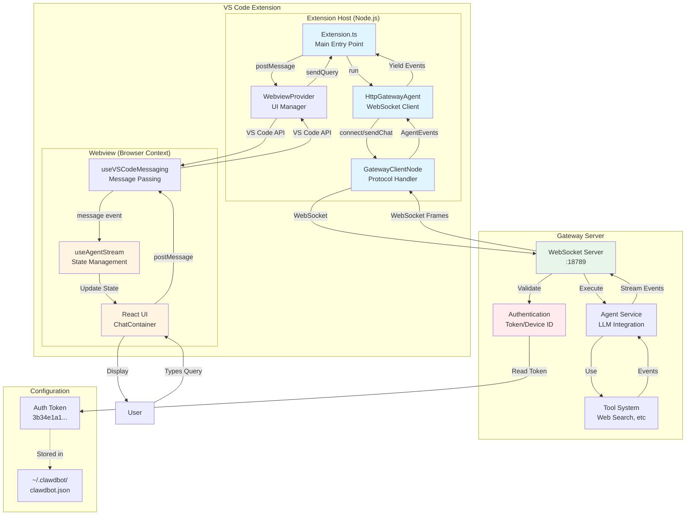
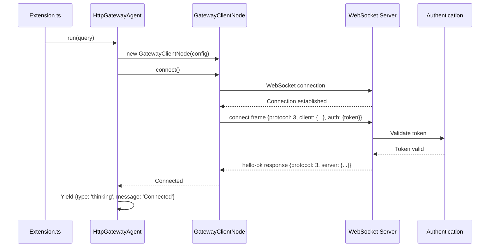
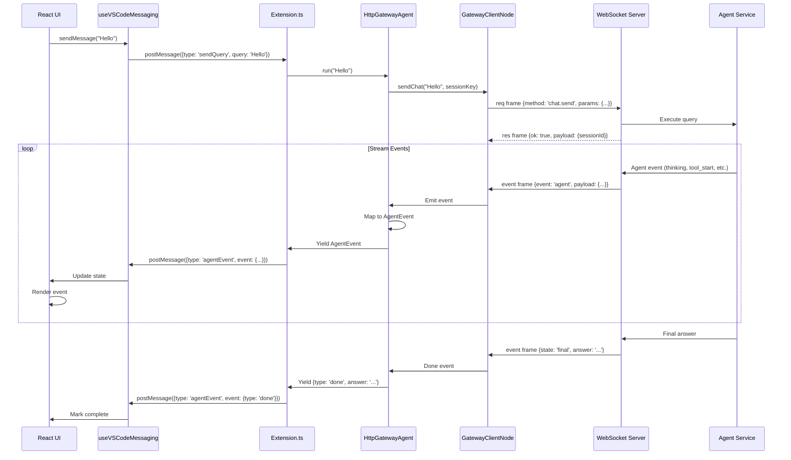
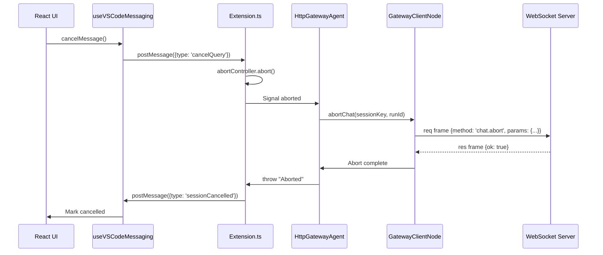

# Clawdbot VS Code Extension - System Architecture

## Overview

The Clawdbot VS Code Extension connects to a WebSocket Gateway to provide AI-powered chat capabilities within VS Code. This document describes the system architecture, data flow, and key components.

## High-Level Architecture



## Component Details

### 1. Extension Host (Node.js Process)

#### Extension.ts
- **Purpose**: Main entry point for VS Code extension
- **Responsibilities**:
  - Register commands (`dexter.openChat`, `dexter.sendQuery`)
  - Manage webview lifecycle
  - Handle message passing between webview and agent
  - Manage abort signals for cancellation

#### HttpGatewayAgent
- **Purpose**: WebSocket-based agent that connects to gateway
- **Responsibilities**:
  - Establish WebSocket connection
  - Send chat queries
  - Stream agent events via async generator
  - Handle reconnection and errors
- **Key Methods**:
  - `run(query)`: Async generator yielding AgentEvent objects
  - `convertHttpToWsUrl()`: Convert HTTP URL to WebSocket URL

#### GatewayClientNode
- **Purpose**: Low-level WebSocket protocol handler (ported from webapp)
- **Responsibilities**:
  - Manage WebSocket connection lifecycle
  - Implement frame-based protocol (req/res/event)
  - Handle authentication with token
  - Event subscription and pub/sub
  - Automatic reconnection with exponential backoff
- **Key Methods**:
  - `connect()`: Establish connection and send connect frame
  - `sendChat(message, sessionKey)`: Send chat message
  - `abortChat(sessionKey, runId)`: Cancel running query
  - `on(event, handler)`: Subscribe to events
  - `request(method, params)`: Request/response pattern

### 2. Webview (Browser Context)

#### React UI (ChatContainer.tsx)
- **Purpose**: User interface for chat interaction
- **Responsibilities**:
  - Display chat messages and events
  - Input form for user queries
  - Real-time event visualization (thinking, tools, etc.)
  - Cancel button for aborting queries

#### useAgentStream Hook
- **Purpose**: State management for agent streaming
- **Responsibilities**:
  - Manage message history
  - Track processing state
  - Handle agent events from extension
  - Map events to UI state
- **Key State**:
  - `messages`: Array of Message objects
  - `isProcessing`: Boolean flag
  - `currentSessionId`: Active session tracking

#### useVSCodeMessaging Hook
- **Purpose**: Bridge between webview and extension host
- **Responsibilities**:
  - Send messages to extension via VS Code API
  - Receive messages from extension
  - Provide typed message passing interface
- **Message Types**:
  - `webviewReady`: Signal webview initialization
  - `sendQuery`: Send user query to agent
  - `cancelQuery`: Abort current query
  - `clearHistory`: Clear chat history

### 3. Gateway Server

#### WebSocket Server
- **URL**: `ws://localhost:18789`
- **Protocol**: Custom frame-based protocol (v3)
- **Responsibilities**:
  - Accept WebSocket connections
  - Authenticate clients (token or device identity)
  - Route requests to appropriate handlers
  - Stream events back to clients

#### Authentication
- **Methods**:
  1. **Token Auth** (used by extension): Shared secret token
  2. **Device Identity**: Public/private key pair
- **Config Location**: `~/.clawdbot/clawdbot.json`
- **Token**: `gateway.auth.token`

#### Agent Service
- **Purpose**: Execute LLM queries with tool support
- **Responsibilities**:
  - Process chat messages
  - Execute tool calls (web search, code execution, etc.)
  - Stream events during execution
  - Return final answers

## Data Flow

### 1. Connection Flow



### 2. Query Flow



### 3. Cancellation Flow



## Protocol Details

### WebSocket Frame Types

#### 1. Request Frame
```typescript
{
  type: "req",
  id: "unique-id",      // Request ID for matching response
  method: string,       // e.g., "connect", "chat.send", "chat.abort"
  params?: any          // Method-specific parameters
}
```

#### 2. Response Frame
```typescript
{
  type: "res",
  id: "unique-id",      // Matches request ID
  ok: boolean,          // Success/failure
  payload?: any,        // Response data if ok: true
  error?: {             // Error details if ok: false
    code: string,
    message: string
  }
}
```

#### 3. Event Frame
```typescript
{
  type: "event",
  event: string,        // Event type (e.g., "agent", "chat")
  payload: any,         // Event-specific data
  seq?: number          // Optional sequence number
}
```

### Connect Frame Example

```json
{
  "type": "req",
  "id": "connect",
  "method": "connect",
  "params": {
    "minProtocol": 3,
    "maxProtocol": 3,
    "client": {
      "id": "webapp",
      "displayName": "VSCode Extension",
      "version": "1.0.0",
      "platform": "browser",
      "mode": "webapp"
    },
    "auth": {
      "token": "3b34e1a1252392a579eacbc66fb11fd6de8b152a2d9579b9"
    }
  }
}
```

### Chat Send Frame Example

```json
{
  "type": "req",
  "id": "r1",
  "method": "chat.send",
  "params": {
    "sessionKey": "agent:main:vscode-12345",
    "message": "What is the weather?",
    "idempotencyKey": "chat-12345-67890"
  }
}
```

### Agent Event Frame Example

```json
{
  "type": "event",
  "event": "agent",
  "payload": {
    "runId": "run-abc123",
    "stream": "tool",
    "data": {
      "phase": "start",
      "name": "web_search",
      "args": { "query": "weather forecast" }
    },
    "sessionKey": "agent:main:vscode-12345",
    "seq": 1
  }
}
```

## Event Mapping

The extension maps gateway events to AgentEvent types:

| Gateway Event | AgentEvent Type | Description |
|--------------|----------------|-------------|
| `stream="tool"`, `phase="start"` | `tool_start` | Tool execution begins |
| `stream="tool"`, `phase="end"` | `tool_end` | Tool execution completes |
| `stream="tool"`, `isError=true` | `tool_error` | Tool execution failed |
| `stream="lifecycle"` | `thinking` | Agent reasoning/planning |
| `event="chat"`, `state="final"` | `done` | Query complete with answer |

## Error Handling

### Connection Errors

1. **"invalid connect params"**
   - Cause: Client ID or other params don't match schema
   - Solution: Use `id: "webapp"`, `platform: "browser"`, `mode: "webapp"`

2. **"device identity required"**
   - Cause: Missing both device identity and auth token
   - Solution: Provide `auth: { token: "..." }` in connect frame

3. **"device identity mismatch"**
   - Cause: Device ID changed (paired device)
   - Solution: Re-pair device or use token auth

### Reconnection Strategy

- **Max Attempts**: 5
- **Backoff**: Exponential (1s, 2s, 4s, 8s, 16s)
- **Auto-reconnect**: Yes (unless explicit disconnect)

## Testing

### Unit Tests

1. **GatewayClientNode Tests** (`test/gateway/gateway-client-node.test.ts`)
   - Connection handshake
   - Request/response pattern
   - Event subscription
   - Error handling
   - Reconnection logic

2. **HttpGatewayAgent Tests** (`test/agent/http-gateway-agent.test.ts`)
   - WebSocket connection
   - Chat message sending
   - Event streaming
   - Abort handling
   - Error mapping

### Manual Testing

1. Start gateway: `cd clawdbot && npm start`
2. Press F5 to launch extension
3. Open command palette: `Ctrl+Shift+P`
4. Run: "Dexter: Open Chat"
5. Send query and observe events

## Configuration

### Gateway Config (`~/.clawdbot/clawdbot.json`)

```json
{
  "gateway": {
    "auth": {
      "mode": "token",
      "token": "3b34e1a1252392a579eacbc66fb11fd6de8b152a2d9579b9"
    }
  }
}
```

### Extension Config (extension.ts)

```typescript
const agent = HttpGatewayAgent.create({
  gatewayUrl: 'http://localhost:3000',  // Deprecated
  gatewayWsUrl: 'ws://localhost:18789', // Preferred
  authToken: '3b34e1a1252392a579eacbc66fb11fd6de8b152a2d9579b9',
  signal: abortController.signal
});
```

## Migration from SSE to WebSocket

The extension was originally using Server-Sent Events (SSE) but was migrated to WebSocket to match the webapp implementation. Key changes:

1. **Replaced**: `fetch()` + SSE parsing → `WebSocket` + frame protocol
2. **Added**: `GatewayClientNode` (ported from webapp)
3. **Updated**: `HttpGatewayAgent` to use WebSocket client
4. **Benefit**: Bidirectional communication, better error handling, auto-reconnect

See [WEBSOCKET_FIX.md](/Users/ghu/aiworker/clawdbot/src/webapp/WEBSOCKET_FIX.md) for details.

## Security Considerations

1. **Token Storage**: Auth token is currently hardcoded in extension.ts
   - **TODO**: Read from secure storage or VS Code secrets API

2. **Token Transmission**: Token sent in connect frame over WebSocket
   - **Mitigation**: Use WSS (wss://) for production

3. **CORS**: Not applicable (WebSocket, not HTTP)

4. **Token Rotation**: Not implemented
   - **TODO**: Support token refresh/rotation

## Performance Considerations

1. **Reconnection**: Exponential backoff prevents connection storms
2. **Event Buffering**: Events queued in memory (limited by available RAM)
3. **Bundle Size**: Extension bundle is 1.5MB (consider code splitting)
4. **Webview**: React UI re-renders on every event (optimized with React.memo)

## Future Enhancements

1. **Dynamic Token Loading**: Read token from config file
2. **Multi-Session Support**: Handle multiple concurrent queries
3. **Offline Mode**: Cache responses for offline use
4. **File Uploads**: Support sending files to agent
5. **Code Actions**: Quick fixes and refactoring suggestions
6. **Token Management**: Secure token storage with VS Code Secrets API
7. **Settings UI**: Configure gateway URL, token, etc. via VS Code settings

## References

- [Gateway Client (webapp)](file:///Users/ghu/aiworker/clawdbot/src/webapp/client/src/lib/gateway-client.ts) - Source of truth for protocol
- [WebSocket Fix Doc](file:///Users/ghu/aiworker/clawdbot/src/webapp/WEBSOCKET_FIX.md) - Auth token solution
- [Gateway Message Handler](file:///Users/ghu/aiworker/clawdbot/src/gateway/server/ws-connection/message-handler.ts) - Server-side implementation
