# System Design: runAgentTurnWithFallback Architecture

## Overview

This document provides a comprehensive system-level design for the `runAgentTurnWithFallback` function and its integration with related components in the Clawdbot agent execution system.

## High-Level Architecture

```mermaid
graph TB
    %% Entry Point
    Start([User Request]) --> RunReplyAgent[runReplyAgent<br/>Main Entry Point]

    %% Main orchestration
    RunReplyAgent --> PreChecks{Pre-flight<br/>Checks}
    PreChecks -->|Should Steer| QueueMsg[Queue Message]
    PreChecks -->|Should Followup| EnqueueFollowup[Enqueue Followup]
    PreChecks -->|Execute Now| MemoryFlush[runMemoryFlushIfNeeded]

    MemoryFlush --> MainExec[runAgentTurnWithFallback<br/>Core Orchestrator]

    %% Main execution loop
    subgraph mainloop["Retry Loop with Fallback"]
        direction TB
        MainExec --> LoopStart{Start<br/>Retry Loop}
        LoopStart --> ModelSelect[Select Model<br/>with Fallback]

        ModelSelect --> ProviderCheck{Provider<br/>Type?}

        %% CLI Provider Path
        ProviderCheck -->|CLI Provider| CliPath[runCliAgent]
        CliPath --> CliResult[CLI Result]

        %% Embedded Provider Path
        ProviderCheck -->|Embedded Provider| EmbeddedPath[runEmbeddedPiAgent]
        EmbeddedPath --> AttemptCall[runEmbeddedAttempt<br/>Low-level Execution]

        %% runEmbeddedAttempt details
        subgraph attempt["runEmbeddedAttempt Execution"]
            direction TB
            AttemptCall --> LockSession[Acquire Session Lock]
            LockSession --> LoadEnv[Load Environment<br/>• Skills<br/>• Bootstrap Files<br/>• Tools]
            LoadEnv --> BeforeHook[runModifyingHook:<br/>before_agent_start]

            subgraph hooks["Hook Execution"]
                BeforeHook --> HookSeq{Sequential<br/>Execution}
                HookSeq --> Plugin1[Plugin 1 Handler]
                Plugin1 --> Plugin2[Plugin 2 Handler]
                Plugin2 --> MergeResults[Merge Results<br/>systemPrompt<br/>prependContext]
            end

            MergeResults --> PrepareSession[Prepare Session<br/>• Sanitize History<br/>• Validate Turns<br/>• Limit History]
            PrepareSession --> DetectImages[Detect & Load Images<br/>• Prompt Images<br/>• History Images]
            DetectImages --> PromptExec[Execute Prompt<br/>session.prompt]
            PromptExec --> WaitCompaction[Wait for Compaction<br/>Retry if Needed]
            WaitCompaction --> AgentEndHook[runModifyingHook:<br/>agent_end]
            AgentEndHook --> ReleaseSession[Release Session Lock]
        end

        ReleaseSession --> EmbeddedResult[Embedded Result]
        CliResult --> CheckError{Error<br/>Occurred?}
        EmbeddedResult --> CheckError

        %% Error Handling
        CheckError -->|No Error| Success[Success Result]
        CheckError -->|Compaction Failure| CompactionError
        CheckError -->|Context Overflow| ContextError
        CheckError -->|Role Ordering| RoleError
        CheckError -->|Session Corruption| CorruptionError
        CheckError -->|Other Error| GenericError[Log Error<br/>Return Fallback]

        %% Compaction Error Recovery
        CompactionError{Already<br/>Reset?}
        CompactionError -->|No| ResetCompaction[resetSessionAfterCompactionFailure]

        subgraph reset["Session Reset Process"]
            direction TB
            ResetCompaction --> GenNewId[Generate New<br/>Session ID]
            GenNewId --> UpdateStore[Update Session Store<br/>• New Session File<br/>• Reset Flags]
            UpdateStore --> CleanupTrans[Cleanup Old<br/>Transcripts]
        end

        CleanupTrans --> RetryMsg[Return Warning<br/>Message]
        CompactionError -->|Yes| RetryMsg

        %% Context Error
        ContextError --> RetryMsg

        %% Role Ordering Error Recovery
        RoleError{Already<br/>Reset?}
        RoleError -->|No| ResetRole[resetSessionAfterRoleOrderingConflict]
        ResetRole --> reset
        RoleError -->|Yes| RetryMsg

        %% Session Corruption Recovery
        CorruptionError --> DeleteCorrupt[Delete Corrupted<br/>Transcript]
        DeleteCorrupt --> RemoveEntry[Remove Session<br/>Store Entry]
        RemoveEntry --> RetryMsg

        %% Loop Control
        RetryMsg --> LoopEnd{Continue<br/>Loop?}
        Success --> LoopEnd
        GenericError --> LoopEnd
        LoopEnd -->|Retry| LoopStart
        LoopEnd -->|Break| ExitLoop
    end

    %% Post-processing
    ExitLoop --> PostProcess{Result<br/>Type?}
    PostProcess -->|Final Payload| DirectReturn[Return Direct]
    PostProcess -->|Success Result| ProcessPayloads[Process Payloads<br/>• Build Reply<br/>• Apply Tags<br/>• Format Usage]

    ProcessPayloads --> PersistUsage[Persist Session Usage<br/>• Model Used<br/>• Tokens<br/>• Context]
    PersistUsage --> BuildPayloads[Build Reply Payloads<br/>• Filter by Mode<br/>• Add Metadata]
    BuildPayloads --> FinalizeReply[Finalize with Followup]

    %% Tool Integration Points
    subgraph tools["Tool & Agent Integration"]
        direction LR
        AgentStepTool[runAgentStep<br/>Nested Agent Calls]
        AgentStepTool --> GatewayCall[Gateway API Call<br/>agent method]
        GatewayCall --> WaitComplete[agent.wait<br/>Wait for Completion]
        WaitComplete --> ReadReply[Read Assistant Reply]
    end

    %% Connections to tool integration
    PromptExec -.->|Tool Execution| AgentStepTool

    %% Stream Processing
    subgraph streaming["Streaming & Events"]
        direction TB
        PartialReply[onPartialReply<br/>Typing Updates]
        BlockReply[onBlockReply<br/>Block Streaming]
        ToolResult[onToolResult<br/>Tool Output]
        AgentEvent[onAgentEvent<br/>Lifecycle Events]
    end

    PromptExec -.->|Events| streaming

    %% Final output
    FinalizeReply --> End([Response to User])
    DirectReturn --> End
    QueueMsg --> End
    EnqueueFollowup --> End

    %% Styling
    classDef entry fill:#d3f9d8,stroke:#2f9e44,stroke-width:2px
    classDef process fill:#e5dbff,stroke:#5f3dc4,stroke-width:2px
    classDef decision fill:#ffe3e3,stroke:#c92a2a,stroke-width:2px
    classDef error fill:#ffe8cc,stroke:#d9480f,stroke-width:2px
    classDef hook fill:#f3d9fa,stroke:#862e9c,stroke-width:2px
    classDef storage fill:#fff4e6,stroke:#e67700,stroke-width:2px
    classDef tool fill:#c5f6fa,stroke:#0c8599,stroke-width:2px
    classDef exit fill:#e7f5ff,stroke:#1971c2,stroke-width:2px

    class Start,RunReplyAgent entry
    class MainExec,AttemptCall,PromptExec,ModelSelect,LoadEnv,PrepareSession,DetectImages,ProcessPayloads,BuildPayloads process
    class PreChecks,LoopStart,ProviderCheck,CheckError,CompactionError,RoleError,LoopEnd,PostProcess decision
    class CompactionError,ContextError,RoleError,CorruptionError,GenericError,ResetCompaction,ResetRole,DeleteCorrupt error
    class BeforeHook,AgentEndHook,HookSeq,Plugin1,Plugin2,MergeResults hook
    class LockSession,ReleaseSession,UpdateStore,PersistUsage,RemoveEntry storage
    class AgentStepTool,GatewayCall,WaitComplete,ReadReply,PartialReply,BlockReply,ToolResult,AgentEvent tool
    class End,DirectReturn,FinalizeReply,Success,ExitLoop exit
```



## Component Details

### 1. runAgentTurnWithFallback

**Location:** `src/auto-reply/reply/agent-runner-execution.ts`

**Responsibilities:**
- Main orchestration loop for agent execution
- Model fallback management
- Comprehensive error handling and recovery
- Integration between CLI and embedded providers
- Stream processing coordination

**Key Features:**

#### Retry Loop
```typescript
while (true) {
  try {
    // Attempt execution with current model
    const fallbackResult = await runWithModelFallback({...})
    break; // Success, exit loop
  } catch (err) {
    // Error classification and recovery
    if (isCompactionFailure && !didResetAfterCompactionFailure) {
      await resetSessionAfterCompactionFailure(message);
      return { kind: "final", payload: {...} };
    }
    // ... other error handlers
  }
}
```

#### Model Selection
- Primary model from configuration
- Fallback chain from agent-specific overrides
- Provider-specific handling (CLI vs Embedded)

#### Error Classification
1. **Compaction Failures** - Context limit during compression
2. **Context Overflow** - Prompt too large for model
3. **Role Ordering Conflicts** - Message sequence violations
4. **Session Corruption** - Gemini function call ordering issues
5. **Generic Errors** - Catch-all with logging

### 2. runEmbeddedAttempt

**Location:** `src/agents/pi-embedded-runner/run/attempt.ts`

**Responsibilities:**
- Low-level embedded agent execution
- Session lifecycle management
- Environment and tool setup
- Hook integration points
- Image detection and injection
- Event streaming coordination

**Execution Flow:**

#### Phase 1: Environment Setup
```typescript
// 1. Resolve workspace and sandbox
const sandbox = await resolveSandboxContext({...});
const effectiveWorkspace = sandbox?.enabled ? sandbox.workspaceDir : resolvedWorkspace;

// 2. Load skills and apply environment overrides
const skillEntries = loadWorkspaceSkillEntries(effectiveWorkspace);
restoreSkillEnv = applySkillEnvOverrides({...});

// 3. Load bootstrap files and context
const { bootstrapFiles, contextFiles } = await resolveBootstrapContextForRun({...});

// 4. Create tools
const tools = createClawdbotCodingTools({...});
```

#### Phase 2: Session Initialization
```typescript
// 1. Acquire session lock
const sessionLock = await acquireSessionWriteLock({...});

// 2. Open or create session
sessionManager = SessionManager.open(params.sessionFile);

// 3. Prepare session for run
await prepareSessionManagerForRun({...});

// 4. Create agent session
({ session } = await createAgentSession({...}));
```

#### Phase 3: Hook Execution (Before)
```typescript
// Run before_agent_start hooks to allow plugins to inject context
if (hookRunner?.hasHooks("before_agent_start")) {
  const hookResult = await hookRunner.runBeforeAgentStart({...}, {...});
  if (hookResult?.prependContext) {
    effectivePrompt = `${hookResult.prependContext}\n\n${params.prompt}`;
  }
}
```

#### Phase 4: History Preparation
```typescript
// 1. Sanitize session history
const prior = await sanitizeSessionHistory({...});

// 2. Validate turns (Gemini/Anthropic specific)
const validatedGemini = validateGeminiTurns(prior);
const validated = validateAnthropicTurns(validatedGemini);

// 3. Limit history turns
const limited = limitHistoryTurns(validated, getDmHistoryLimitFromSessionKey(...));

// 4. Replace messages in agent
activeSession.agent.replaceMessages(limited);
```

#### Phase 5: Image Processing
```typescript
// Detect and load images referenced in the prompt
const imageResult = await detectAndLoadPromptImages({
  prompt: effectivePrompt,
  workspaceDir: effectiveWorkspace,
  model: params.model,
  existingImages: params.images,
  historyMessages: activeSession.messages,
  maxBytes: MAX_IMAGE_BYTES,
  sandboxRoot: sandbox?.enabled ? sandbox.workspaceDir : undefined,
});

// Inject history images into their original message positions
const didMutate = injectHistoryImagesIntoMessages(
  activeSession.messages,
  imageResult.historyImagesByIndex,
);
```

#### Phase 6: Prompt Execution
```typescript
// Execute prompt with optional images
if (imageResult.images.length > 0) {
  await abortable(activeSession.prompt(effectivePrompt, { images: imageResult.images }));
} else {
  await abortable(activeSession.prompt(effectivePrompt));
}

// Wait for any compaction retries
await waitForCompactionRetry();
```

#### Phase 7: Hook Execution (After)
```typescript
// Run agent_end hooks to allow plugins to analyze the conversation
if (hookRunner?.hasHooks("agent_end")) {
  hookRunner.runAgentEnd({
    messages: messagesSnapshot,
    success: !aborted && !promptError,
    error: promptError ? describeUnknownError(promptError) : undefined,
    durationMs: Date.now() - promptStartedAt,
  }, {...}).catch((err) => {
    log.warn(`agent_end hook failed: ${err}`);
  });
}
```

#### Phase 8: Cleanup
```typescript
// Always tear down the session and release the lock
sessionManager?.flushPendingToolResults?.();
session?.dispose();
await sessionLock.release();
```

### 3. runModifyingHook

**Location:** `src/plugins/hooks.ts`

**Responsibilities:**
- Sequential execution of plugin hooks
- Result merging across multiple plugins
- Error handling and logging
- Support for both async and sync hooks

**Hook Types:**

#### Modifying Hooks (Sequential)
Handlers execute in priority order (highest first) and can modify data:
- `before_agent_start` - Inject context into system prompt
- `before_tool_call` - Modify or block tool calls
- `message_sending` - Modify or cancel outgoing messages
- `tool_result_persist` - Transform tool results before storage (sync only)

#### Void Hooks (Parallel)
Handlers execute concurrently for performance:
- `agent_end` - Analyze completed conversations
- `after_tool_call` - Process tool execution results
- `message_received` - Track incoming messages
- `message_sent` - Track outgoing messages

**Execution Flow:**

```typescript
async function runModifyingHook<K extends PluginHookName, TResult>(
  hookName: K,
  event: Parameters<...>[0],
  ctx: Parameters<...>[1],
  mergeResults?: (accumulated: TResult | undefined, next: TResult) => TResult,
): Promise<TResult | undefined> {
  const hooks = getHooksForName(registry, hookName);
  if (hooks.length === 0) return undefined;

  let result: TResult | undefined;

  // Sequential execution with priority ordering
  for (const hook of hooks) {
    try {
      const handlerResult = await hook.handler(event, ctx);

      if (handlerResult !== undefined && handlerResult !== null) {
        if (mergeResults && result !== undefined) {
          result = mergeResults(result, handlerResult);
        } else {
          result = handlerResult;
        }
      }
    } catch (err) {
      // Error handling with optional throwing
      if (catchErrors) {
        logger?.error(`[hooks] ${hookName} handler failed: ${err}`);
      } else {
        throw new Error(`[hooks] ${hookName} handler failed: ${err}`);
      }
    }
  }

  return result;
}
```

**before_agent_start Example:**

```typescript
async function runBeforeAgentStart(
  event: PluginHookBeforeAgentStartEvent,
  ctx: PluginHookAgentContext,
): Promise<PluginHookBeforeAgentStartResult | undefined> {
  return runModifyingHook<"before_agent_start", PluginHookBeforeAgentStartResult>(
    "before_agent_start",
    event,
    ctx,
    // Merge function: concatenate prependContext from all plugins
    (acc, next) => ({
      systemPrompt: next.systemPrompt ?? acc?.systemPrompt,
      prependContext:
        acc?.prependContext && next.prependContext
          ? `${acc.prependContext}\n\n${next.prependContext}`
          : (next.prependContext ?? acc?.prependContext),
    }),
  );
}
```

### 4. resetSessionAfterCompactionFailure

**Location:** `src/auto-reply/reply/agent-runner.ts`

**Responsibilities:**
- Session recovery after compaction failures
- Generation of new session IDs
- Session store updates
- Transcript cleanup (optional)

**Recovery Process:**

```typescript
const resetSessionAfterCompactionFailure = async (reason: string): Promise<boolean> =>
  resetSession({
    failureLabel: "compaction failure",
    buildLogMessage: (nextSessionId) =>
      `Auto-compaction failed (${reason}). Restarting session ${sessionKey} -> ${nextSessionId} and retrying.`,
  });
```

**Generic Reset Implementation:**

```typescript
const resetSession = async ({
  failureLabel,
  buildLogMessage,
  cleanupTranscripts,
}: SessionResetOptions): Promise<boolean> => {
  if (!sessionKey || !activeSessionStore || !storePath) return false;

  const prevEntry = activeSessionStore[sessionKey] ?? activeSessionEntry;
  if (!prevEntry) return false;

  const prevSessionId = cleanupTranscripts ? prevEntry.sessionId : undefined;
  const nextSessionId = crypto.randomUUID();

  // Create new session entry
  const nextEntry: SessionEntry = {
    ...prevEntry,
    sessionId: nextSessionId,
    updatedAt: Date.now(),
    systemSent: false,
    abortedLastRun: false,
  };

  // Update session file path
  const agentId = resolveAgentIdFromSessionKey(sessionKey);
  const nextSessionFile = resolveSessionTranscriptPath(
    nextSessionId,
    agentId,
    sessionCtx.MessageThreadId,
  );
  nextEntry.sessionFile = nextSessionFile;

  // Update in-memory and persistent stores
  activeSessionStore[sessionKey] = nextEntry;
  await updateSessionStore(storePath, (store) => {
    store[sessionKey] = nextEntry;
  });

  // Update followup run
  followupRun.run.sessionId = nextSessionId;
  followupRun.run.sessionFile = nextSessionFile;
  activeSessionEntry = nextEntry;
  activeIsNewSession = true;

  // Cleanup old transcripts if requested
  if (cleanupTranscripts && prevSessionId) {
    const transcriptCandidates = new Set<string>();
    const resolved = resolveSessionFilePath(prevSessionId, prevEntry, { agentId });
    if (resolved) transcriptCandidates.add(resolved);
    transcriptCandidates.add(resolveSessionTranscriptPath(prevSessionId, agentId));

    for (const candidate of transcriptCandidates) {
      try {
        fs.unlinkSync(candidate);
      } catch {
        // Best-effort cleanup
      }
    }
  }

  return true;
};
```

**Error Scenarios:**

1. **Compaction Failure** (`cleanupTranscripts: false`)
   - Context limit exceeded during compaction
   - Keeps old transcripts for debugging
   - User can retry immediately

2. **Role Ordering Conflict** (`cleanupTranscripts: true`)
   - Message sequence violations
   - Deletes corrupted transcripts
   - Forces fresh conversation

### 5. runAgentStep

**Location:** `src/agents/tools/agent-step.ts`

**Responsibilities:**
- Nested agent execution via gateway
- Tool integration for agent-to-agent communication
- Asynchronous result waiting

**Execution Flow:**

```typescript
export async function runAgentStep(params: {
  sessionKey: string;
  message: string;
  extraSystemPrompt: string;
  timeoutMs: number;
  channel?: string;
  lane?: string;
}): Promise<string | undefined> {
  // 1. Generate idempotency key
  const stepIdem = crypto.randomUUID();

  // 2. Submit agent request to gateway
  const response = await callGateway({
    method: "agent",
    params: {
      message: params.message,
      sessionKey: params.sessionKey,
      idempotencyKey: stepIdem,
      deliver: false, // Don't send to user
      channel: params.channel ?? INTERNAL_MESSAGE_CHANNEL,
      lane: params.lane ?? AGENT_LANE_NESTED,
      extraSystemPrompt: params.extraSystemPrompt,
    },
    timeoutMs: 10_000,
  });

  // 3. Extract run ID
  const stepRunId = response?.runId || stepIdem;
  const stepWaitMs = Math.min(params.timeoutMs, 60_000);

  // 4. Wait for completion
  const wait = await callGateway({
    method: "agent.wait",
    params: {
      runId: stepRunId,
      timeoutMs: stepWaitMs,
    },
    timeoutMs: stepWaitMs + 2000,
  });

  // 5. Check status and read reply
  if (wait?.status !== "ok") return undefined;
  return await readLatestAssistantReply({ sessionKey: params.sessionKey });
}
```

**Use Cases:**
- Tool calls that need agent reasoning
- Multi-step agent workflows
- Agent-to-agent delegation
- Nested problem solving

## Data Flow

### Input Processing

```
User Request
  ↓
runReplyAgent
  ↓
Pre-flight Checks
  ├─→ Should Steer? → Queue Message
  ├─→ Should Followup? → Enqueue Followup
  └─→ Execute Now → runAgentTurnWithFallback
```

### Agent Execution

```
runAgentTurnWithFallback
  ↓
Model Selection with Fallback
  ↓
Provider Routing
  ├─→ CLI Provider → runCliAgent
  └─→ Embedded Provider
        ↓
      runEmbeddedPiAgent
        ↓
      runEmbeddedAttempt
        ├─→ Load Environment
        ├─→ Execute Hooks (before_agent_start)
        ├─→ Prepare Session
        ├─→ Detect Images
        ├─→ Execute Prompt
        ├─→ Wait Compaction
        └─→ Execute Hooks (agent_end)
```

### Error Recovery

```
Error Detection
  ↓
Error Classification
  ├─→ Compaction Failure
  │     ↓
  │   resetSessionAfterCompactionFailure
  │     ├─→ Generate New Session ID
  │     ├─→ Update Session Store
  │     └─→ Return Warning Message
  │
  ├─→ Context Overflow
  │     └─→ Return Warning Message
  │
  ├─→ Role Ordering Conflict
  │     ↓
  │   resetSessionAfterRoleOrderingConflict
  │     ├─→ Generate New Session ID
  │     ├─→ Update Session Store
  │     ├─→ Cleanup Old Transcripts
  │     └─→ Return Warning Message
  │
  ├─→ Session Corruption
  │     ├─→ Delete Corrupted Transcript
  │     ├─→ Remove Session Store Entry
  │     └─→ Return Warning Message
  │
  └─→ Generic Error
        ├─→ Log Error
        └─→ Return Fallback Message
```

### Response Processing

```
Execution Result
  ↓
Result Type Check
  ├─→ Final Payload → Return Direct
  └─→ Success Result
        ↓
      Process Payloads
        ├─→ Build Reply
        ├─→ Apply Tags
        └─→ Format Usage
        ↓
      Persist Session Usage
        ├─→ Model Used
        ├─→ Token Counts
        └─→ Context Size
        ↓
      Build Reply Payloads
        ├─→ Filter by Mode
        └─→ Add Metadata
        ↓
      Finalize with Followup
        ↓
      Response to User
```

## Event Streaming

The system supports multiple streaming channels for real-time feedback:

### Streaming Types

1. **Partial Reply** (`onPartialReply`)
   - Character-by-character text streaming
   - Typing indicator updates
   - Progressive response building

2. **Block Reply** (`onBlockReply`)
   - Paragraph/sentence-level chunks
   - Configurable chunking strategy
   - Buffer management with timeouts

3. **Tool Results** (`onToolResult`)
   - Tool execution output
   - Formatted as markdown or plain text
   - Verbose level filtering

4. **Agent Events** (`onAgentEvent`)
   - Lifecycle events (start, end, error)
   - Tool execution phases
   - Compaction status updates

### Stream Processing Pipeline

```
Agent Execution
  ↓
Event Emission
  ├─→ Partial Reply Stream
  │     ├─→ Normalize Streaming Text
  │     ├─→ Strip Heartbeat Tokens
  │     ├─→ Filter Silent Replies
  │     └─→ Signal Typing Updates
  │
  ├─→ Block Reply Stream
  │     ├─→ Apply Reply Tags
  │     ├─→ Parse Reply Directives
  │     ├─→ Enqueue to Pipeline
  │     └─→ Flush on Tool Execution
  │
  ├─→ Tool Result Stream
  │     ├─→ Format Tool Output
  │     ├─→ Apply Verbose Filtering
  │     └─→ Emit to Callbacks
  │
  └─→ Agent Event Stream
        ├─→ Lifecycle Events
        ├─→ Tool Execution Status
        └─→ Compaction Progress
```

## Session Management

### Session Lifecycle

```
Session Initialization
  ↓
Acquire Session Lock
  ↓
Open/Create Session Manager
  ↓
Prepare Session for Run
  ├─→ Load Existing History
  ├─→ Sanitize Messages
  ├─→ Validate Turns
  └─→ Limit History
  ↓
Execute Agent Turn
  ↓
Update Session State
  ├─→ Append Messages
  ├─→ Record Usage
  └─→ Update Metadata
  ↓
Release Session Lock
```

### Session Reset Triggers

1. **Compaction Failure**
   - Trigger: Context limit during compaction
   - Action: Generate new session ID
   - Cleanup: Keep old transcripts
   - Retry: Immediate

2. **Role Ordering Conflict**
   - Trigger: Message sequence violations
   - Action: Generate new session ID
   - Cleanup: Delete old transcripts
   - Retry: Immediate

3. **Session Corruption**
   - Trigger: Gemini function call ordering issues
   - Action: Remove session entry
   - Cleanup: Delete all transcripts
   - Retry: User must retry

4. **Context Overflow**
   - Trigger: Prompt too large
   - Action: User warning
   - Cleanup: None
   - Retry: User must simplify

## Plugin Hook System

### Hook Execution Models

#### Sequential Execution (Modifying Hooks)

```
Hook Trigger
  ↓
Get Registered Handlers (sorted by priority)
  ↓
For Each Handler (highest priority first):
  ├─→ Execute Handler
  ├─→ Check Result
  └─→ Merge with Accumulated Result
  ↓
Return Merged Result
```

**Example: before_agent_start**

```
Plugin A (priority: 10):
  Returns: { prependContext: "Context A" }

Plugin B (priority: 5):
  Returns: { prependContext: "Context B" }

Merged Result:
  { prependContext: "Context A\n\nContext B" }
```

#### Parallel Execution (Void Hooks)

```
Hook Trigger
  ↓
Get Registered Handlers
  ↓
Execute All Handlers Concurrently
  ├─→ Handler 1
  ├─→ Handler 2
  └─→ Handler N
  ↓
Wait for All Completions
  ↓
Continue (ignore results)
```

**Example: agent_end**

```
Plugin A: Logs conversation to database
Plugin B: Generates analytics report
Plugin C: Updates user profile

All execute in parallel for performance
```

### Hook Integration Points

1. **before_agent_start** (in runEmbeddedAttempt)
   - Location: After environment setup, before prompt execution
   - Purpose: Inject context into system prompt
   - Usage: Memory systems, context injection, prompt modification

2. **agent_end** (in runEmbeddedAttempt)
   - Location: After prompt completion, before session cleanup
   - Purpose: Analyze completed conversations
   - Usage: Logging, analytics, learning systems

3. **before_tool_call** (in tool execution)
   - Location: Before tool function is called
   - Purpose: Modify or block tool calls
   - Usage: Security checks, parameter validation, logging

4. **after_tool_call** (in tool execution)
   - Location: After tool function completes
   - Purpose: Process tool results
   - Usage: Logging, metrics, result transformation

5. **tool_result_persist** (in session transcript)
   - Location: Before tool result is written to transcript
   - Purpose: Transform tool results before storage
   - Usage: Sanitization, compression, formatting

## Error Handling Strategy

### Error Classification Matrix

| Error Type | Detection | Recovery | Retry | Cleanup |
|------------|-----------|----------|-------|---------|
| Compaction Failure | `isCompactionFailureError()` | Reset session | Yes | Keep transcripts |
| Context Overflow | `isContextOverflowError()` or `isLikelyContextOverflowError()` | User warning | No | None |
| Role Ordering | `/incorrect role information\|roles must alternate/i` | Reset session | Yes | Delete transcripts |
| Session Corruption | `/function call turn comes immediately after/i` | Delete session | No | Delete all files |
| Generic Error | Catch-all | Log and return | No | None |

### Recovery Procedures

#### Compaction Failure Recovery

```typescript
// Detect error
if (isCompactionFailureError(message) && !didResetAfterCompactionFailure) {
  // Attempt reset
  const didReset = await resetSessionAfterCompactionFailure(message);

  if (didReset) {
    // Mark that reset occurred (prevent infinite loop)
    didResetAfterCompactionFailure = true;

    // Return user-facing message
    return {
      kind: "final",
      payload: {
        text: "⚠️ Context limit exceeded during compaction. I've reset our conversation to start fresh - please try again.\n\nTo prevent this, increase your compaction buffer by setting `agents.defaults.compaction.reserveTokensFloor` to 4000 or higher in your config.",
      },
    };
  }
}
```

#### Role Ordering Recovery

```typescript
// Detect error
if (isRoleOrderingError) {
  // Attempt reset
  const didReset = await resetSessionAfterRoleOrderingConflict(message);

  if (didReset) {
    // Return user-facing message
    return {
      kind: "final",
      payload: {
        text: "⚠️ Message ordering conflict. I've reset the conversation - please try again.",
      },
    };
  }
}
```

#### Session Corruption Recovery

```typescript
// Detect corruption (Gemini specific)
if (isSessionCorruption && sessionKey && activeSessionStore && storePath) {
  const sessionKey = params.sessionKey;
  const corruptedSessionId = params.getActiveSessionEntry()?.sessionId;

  // Delete transcript file
  if (corruptedSessionId) {
    const transcriptPath = resolveSessionTranscriptPath(corruptedSessionId);
    try {
      fs.unlinkSync(transcriptPath);
    } catch {
      // Ignore if file doesn't exist
    }
  }

  // Remove from in-memory store
  delete params.activeSessionStore[sessionKey];

  // Remove from persistent store
  await updateSessionStore(params.storePath, (store) => {
    delete store[sessionKey];
  });

  // Return user-facing message
  return {
    kind: "final",
    payload: {
      text: "⚠️ Session history was corrupted. I've reset the conversation - please try again!",
    },
  };
}
```

### Error Prevention

1. **Session Locking**
   - Prevents concurrent writes to session files
   - Ensures data consistency
   - Implemented via `acquireSessionWriteLock()`

2. **History Validation**
   - Sanitize messages before execution
   - Validate turn ordering (Gemini/Anthropic)
   - Limit history length

3. **Compaction Buffer**
   - Reserve tokens for model response
   - Configurable via `compaction.reserveTokensFloor`
   - Default floor prevents early failures

4. **Abort Handling**
   - Graceful shutdown on timeout
   - Cancel in-flight API calls
   - Clean session state

## Tool Integration

### Tool Execution Flow

```
Agent Requests Tool Call
  ↓
Hook: before_tool_call
  ├─→ Validate Parameters
  ├─→ Apply Security Checks
  └─→ Return Modified Params or Block
  ↓
Execute Tool Function
  ├─→ Regular Tool → Direct Execution
  └─→ Agent Step Tool → runAgentStep
        ├─→ Call Gateway API
        ├─→ Wait for Completion
        └─→ Read Assistant Reply
  ↓
Hook: after_tool_call
  ├─→ Log Execution
  ├─→ Record Metrics
  └─→ Transform Result
  ↓
Hook: tool_result_persist (sync)
  ├─→ Sanitize Content
  ├─→ Compress Data
  └─→ Format for Storage
  ↓
Append to Session Transcript
  ↓
Stream to User (if enabled)
```

### Agent Step Tool

The `runAgentStep` function enables nested agent execution:

```typescript
// Example: Agent delegates subtask to another agent
const result = await runAgentStep({
  sessionKey: "task-solver:abc123",
  message: "Analyze the error logs and suggest fixes",
  extraSystemPrompt: "You are a debugging specialist",
  timeoutMs: 60_000,
  channel: "internal",
  lane: "nested",
});
```

**Key Features:**
- Idempotency via unique keys
- Asynchronous execution with waiting
- Internal channel (no user delivery)
- Nested execution lane
- Timeout management

## Performance Considerations

### Optimization Strategies

1. **Parallel Hook Execution**
   - Void hooks run concurrently
   - Reduces total execution time
   - Example: `agent_end`, `after_tool_call`

2. **Session Caching**
   - Prewarm session files
   - Track access patterns
   - Reduce disk I/O

3. **Block Reply Pipeline**
   - Coalesce small text chunks
   - Configurable buffering
   - Timeout-based flushing

4. **History Limiting**
   - Configurable turn limits
   - DM-specific overrides
   - Prevents context bloat

### Resource Management

1. **Session Locks**
   - Prevents file corruption
   - Minimal lock duration
   - Automatic release on error

2. **Abort Handling**
   - Timeout enforcement
   - Graceful cancellation
   - Resource cleanup

3. **Memory Management**
   - Streaming responses
   - Limited history retention
   - Garbage collection friendly

## Configuration Options

### Agent Configuration

```typescript
{
  agents: {
    defaults: {
      // Model selection
      provider: "anthropic",
      model: "claude-sonnet-4.5",

      // Compaction settings
      compaction: {
        reserveTokensFloor: 4000, // Minimum buffer for response
        mode: "auto" | "manual" | "cache-ttl",
      },

      // Response settings
      responseUsage: "off" | "simple" | "full",

      // Heartbeat for idle sessions
      heartbeat: {
        prompt: "Continue working on the task",
      },
    },
  },

  // Model-specific overrides
  models: {
    providers: {
      anthropic: {
        fallbacks: ["claude-sonnet-4", "claude-opus-4"],
      },
    },
  },
}
```

### Session Configuration

```typescript
{
  sessions: {
    // History limiting
    dmHistoryLimit: 50, // Turn limit for DM conversations

    // Response behavior
    blockStreaming: true,
    blockStreamingBreak: "text_end" | "message_end",
    blockReplyChunking: {
      minChars: 100,
      maxChars: 500,
      breakPreference: "paragraph" | "newline" | "sentence",
    },
  },
}
```

### Tool Configuration

```typescript
{
  tools: {
    // Bash execution
    bashElevated: false,

    // Sandbox settings
    sandbox: {
      enabled: true,
      workspaceAccess: "ro" | "rw",
    },

    // Timeout settings
    timeoutMs: 120_000,
  },
}
```

## File Locations

### Core Implementation Files

- **runAgentTurnWithFallback**: `src/auto-reply/reply/agent-runner-execution.ts`
- **runReplyAgent**: `src/auto-reply/reply/agent-runner.ts`
- **runEmbeddedAttempt**: `src/agents/pi-embedded-runner/run/attempt.ts`
- **runEmbeddedPiAgent**: `src/agents/pi-embedded.ts`
- **runCliAgent**: `src/agents/cli-runner.ts`

### Hook System Files

- **createHookRunner**: `src/plugins/hooks.ts`
- **getGlobalHookRunner**: `src/plugins/hook-runner-global.ts`
- **Hook Types**: `src/plugins/types.ts`
- **Plugin Registry**: `src/plugins/registry.ts`

### Tool Files

- **runAgentStep**: `src/agents/tools/agent-step.ts`
- **createClawdbotCodingTools**: `src/agents/pi-tools.ts`
- **Tool Definitions**: `src/agents/pi-tool-definition-adapter.ts`

### Session Management Files

- **SessionManager**: `@mariozechner/pi-coding-agent`
- **Session Store**: `src/config/sessions.ts`
- **Session Locking**: `src/agents/session-write-lock.ts`
- **Session Cache**: `src/agents/pi-embedded-runner/session-manager-cache.ts`

### Error Handling Files

- **Error Detection**: `src/agents/pi-embedded-helpers.ts`
- **Model Fallback**: `src/agents/model-fallback.ts`
- **Abort Handling**: `src/agents/pi-embedded-runner/abort.ts`

## Testing Considerations

### Unit Testing

1. **Hook Execution**
   ```typescript
   test('runModifyingHook merges results sequentially', async () => {
     // Test priority ordering
     // Test result merging
     // Test error handling
   });
   ```

2. **Session Reset**
   ```typescript
   test('resetSessionAfterCompactionFailure creates new session', async () => {
     // Test ID generation
     // Test store updates
     // Test transcript cleanup
   });
   ```

3. **Error Classification**
   ```typescript
   test('error detection identifies compaction failures', () => {
     // Test regex patterns
     // Test error message matching
   });
   ```

### Integration Testing

1. **End-to-End Flow**
   ```typescript
   test('runAgentTurnWithFallback handles compaction failure', async () => {
     // Mock compaction failure
     // Verify reset triggered
     // Verify retry succeeded
   });
   ```

2. **Hook Integration**
   ```typescript
   test('before_agent_start hooks inject context', async () => {
     // Register test hooks
     // Execute agent turn
     // Verify context injection
   });
   ```

3. **Tool Execution**
   ```typescript
   test('runAgentStep executes nested agent', async () => {
     // Mock gateway API
     // Execute agent step
     // Verify result retrieval
   });
   ```

## Monitoring and Observability

### Logging Points

1. **Execution Start/End**
   ```typescript
   log.debug(`embedded run start: runId=${runId} sessionId=${sessionId}`);
   log.debug(`embedded run end: durationMs=${duration}`);
   ```

2. **Error Events**
   ```typescript
   log.error(`Embedded agent failed before reply: ${message}`);
   log.warn(`Auto-compaction failed (${reason})`);
   ```

3. **Hook Execution**
   ```typescript
   logger?.debug(`[hooks] running ${hookName} (${hooks.length} handlers)`);
   logger?.error(`[hooks] ${hookName} handler from ${pluginId} failed`);
   ```

### Metrics Collection

1. **Usage Tracking**
   ```typescript
   emitDiagnosticEvent({
     type: "model.usage",
     sessionKey,
     provider,
     model,
     usage: { input, output, cacheRead, cacheWrite },
     costUsd,
     durationMs,
   });
   ```

2. **Error Rates**
   - Compaction failures per session
   - Context overflow frequency
   - Session corruption incidents

3. **Performance Metrics**
   - Average execution duration
   - Hook execution time
   - Tool call latency

### Tracing

```typescript
// Cache trace for request/response debugging
const cacheTrace = createCacheTrace({
  cfg,
  runId,
  sessionId,
  provider,
  modelId,
});

cacheTrace?.recordStage("session:loaded", { messages });
cacheTrace?.recordStage("prompt:before", { prompt, messages });
cacheTrace?.recordStage("session:after", { messages });
```

## Security Considerations

### Input Validation

1. **Prompt Sanitization**
   - Strip control characters
   - Validate encoding
   - Limit size

2. **Tool Parameter Validation**
   - Type checking
   - Range validation
   - Hook-based security checks

### Session Security

1. **Session Isolation**
   - Unique session IDs
   - File-based separation
   - Lock-based concurrency control

2. **Sandbox Enforcement**
   - Restricted workspace access
   - Tool execution limits
   - Path validation

### Error Information Disclosure

1. **User-Facing Messages**
   - Generic error descriptions
   - No stack traces
   - Configuration-aware suggestions

2. **Internal Logging**
   - Full error details
   - Stack traces
   - Sensitive data redaction

## Future Enhancements

### Potential Improvements

1. **Distributed Tracing**
   - OpenTelemetry integration
   - Cross-service correlation
   - Performance profiling

2. **Advanced Error Recovery**
   - Automatic context pruning
   - Partial session recovery
   - Smart retry strategies

3. **Enhanced Hook System**
   - Conditional hook execution
   - Hook dependencies
   - Hook state management

4. **Performance Optimization**
   - Session pooling
   - Parallel agent execution
   - Predictive preloading

## Conclusion

The `runAgentTurnWithFallback` architecture provides a robust, extensible system for agent execution with comprehensive error handling, plugin integration, and performance optimization. The modular design separates concerns while maintaining tight integration between components, enabling reliable agent operations across diverse deployment scenarios.

Key strengths:
- **Resilient Error Recovery**: Multiple fallback strategies
- **Extensible Plugin System**: Sequential and parallel hooks
- **Performance Optimized**: Streaming, caching, and parallel execution
- **Production Ready**: Comprehensive logging, metrics, and tracing

The architecture supports both CLI and embedded agent providers, handles complex session management, and provides a foundation for building sophisticated AI agent systems.
