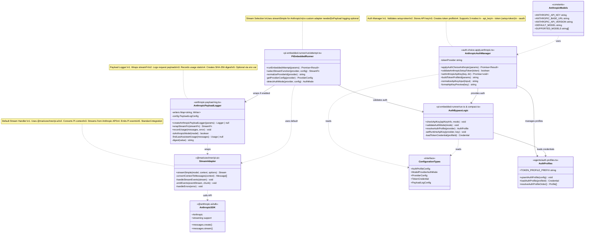

# Anthropic Client - Class Design Diagram



## Class Design Overview

This diagram shows the **Anthropic Client class structure** - using the standard Pi AI streaming integration with optional payload logging.

### Core Classes

#### 1. AnthropicModels (Constants)
**File:** Configuration constants (distributed across config files)

Configuration constants:
- `ANTHROPIC_API_KEY`: API key from environment or auth profiles
- `ANTHROPIC_BASE_URL`: Base URL for Anthropic API (default: https://api.anthropic.com)
- `ANTHROPIC_API_VERSION`: API version (e.g., "2023-06-01")
- `DEFAULT_MODEL`: Default model (e.g., "claude-sonnet-4-5-20250929")
- `SUPPORTED_MODELS`: List of available Claude models

---

#### 2. AnthropicAuthManager (Auth Manager)
**File:** `src/commands/auth-choice.apply.anthropic.ts`

**Purpose:** Manages Anthropic authentication and API key storage

**Key Methods:**
- `applyAuthChoiceAnthropic()`: Handles auth choice flow
- `validateAnthropicSetupToken()`: Validates setup-token format
- `setAnthropicApiKey()`: Stores API key securely
- `buildTokenProfileId()`: Creates named token profile ID
- `normalizeApiKeyInput()`: Normalizes API key format
- `formatApiKeyPreview()`: Formats key for display

**Supported Auth Modes:**
1. **api_key**: Direct API key from environment or user input
2. **token** (setup-token): Token from `claude setup-token` command
3. **oauth**: OAuth-based authentication

**Process:**
1. Prompt user for auth choice
2. Validate credentials (API key or setup-token)
3. Store in auth profile
4. Update config with auth mode

---

#### 3. AnthropicPayloadLogger (Payload Logger)
**File:** `src/agents/anthropic-payload-log.ts`

**Purpose:** Optional logging of Anthropic API requests and usage

**Key Methods:**
- `createAnthropicPayloadLogger()`: Creates logger instance (if enabled)
- `wrapStreamFn()`: Wraps stream function to intercept payloads
- `recordUsage()`: Records usage statistics from messages
- `isAnthropicModel()`: Checks if model is Anthropic
- `findLastAssistantUsage()`: Extracts usage from message history
- `digest()`: Creates SHA-256 hash of payload

**Features:**
- JSONL log format
- Request payload logging
- Usage statistics tracking
- SHA-256 payload digest
- Configurable via `CLAWDBOT_ANTHROPIC_PAYLOAD_LOG` env var
- Custom log path via `CLAWDBOT_ANTHROPIC_PAYLOAD_LOG_FILE`

**Process:**
1. Check if logging enabled (env var)
2. Wrap streamFn to intercept payloads
3. Log request with timestamp and digest
4. Log usage after completion
5. Handle errors gracefully

---

#### 4. StreamAdapter (Default Stream Handler)
**File:** `@mariozechner/pi-ai` (external package)

**Purpose:** Standard Pi AI streaming adapter for Anthropic

**Key Methods:**
- `streamSimple()`: Main streaming function (default)
- `convertContextToMessages()`: Pi → Anthropic format
- `handleStreamEvents()`: Process streaming chunks
- `emitEvents()`: Emit Pi-compatible events
- `handleErrors()`: Error handling

**Process:**
1. Convert Pi context to Anthropic messages
2. Stream from Anthropic API via SDK
3. Emit Pi-compatible events
4. Handle errors and retries
5. Standard integration (no custom adapter)

---

#### 5. PiEmbeddedRunner (Detection & Routing)
**File:** `src/agents/pi-embedded-runner/run/attempt.ts`

**Purpose:** Detects provider and routes to appropriate stream function

**Detection Logic:**
```typescript
const normalizedProvider = normalizeProviderId(provider)
const providerConfig = config.models.providers[normalizedProvider]

// For Azure OpenAI with managed identity
if (normalizedProvider === 'azureopenai' && providerConfig.auth === 'managedidentity') {
  activeSession.agent.streamFn = streamAzureOpenAINative
}
// For all other providers (including Anthropic)
else {
  activeSession.agent.streamFn = streamSimple
}

// Optional: Wrap with payload logger for Anthropic
if (anthropicPayloadLogger && normalizedProvider === 'anthropic') {
  activeSession.agent.streamFn = anthropicPayloadLogger.wrapStreamFn(
    activeSession.agent.streamFn
  )
}
```

**Anthropic-Specific:**
- Uses default `streamSimple` (no custom adapter needed)
- Optional payload logging wrapper
- Standard auth via API key or token

---

#### 6. AuthBypassLogic (API Key Management)
**File:** `src/agents/pi-embedded-runner/run.ts` & related files

**Purpose:** Validates and manages API keys for different auth modes

**Key Logic:**
```typescript
const authMode = providerConfig.auth
const apiKeyInfo = await resolveApiKey(provider, authMode)

if (!apiKeyInfo.apiKey) {
  if (authMode !== 'api_key' && authMode !== 'token' && authMode !== 'oauth') {
    throw Error('No API key or token configured')
  }

  if (authMode === 'token') {
    // Load from auth profile
    const credential = loadAuthProfile(profileId)
    authStorage.setRuntimeApiKey(provider, credential.token)
  }
}
```

**Supported Modes:**
- `api_key`: Direct API key (from env or config)
- `token`: Setup-token (stored in auth profiles)
- `oauth`: OAuth credentials

---

#### 7. ConfigurationTypes (Type Definitions)
**Files:** Various type definition files

**Key Types:**
- `AuthProfileConfig`: { mode, provider, profileId }
- `ModelProviderAuthMode`: 'api_key' | 'token' | 'oauth' | 'managedidentity' | 'aws-sdk'
- `ProviderConfig`: { auth, baseUrl, api }
- `TokenCredential`: { type, provider, token }
- `PayloadLogConfig`: { enabled, filePath }

---

#### 8. AuthProfiles (Profile Management)
**File:** `src/agents/auth-profiles.ts`

**Purpose:** Manages persistent auth credentials

**Key Methods:**
- `upsertAuthProfile()`: Create or update auth profile
- `loadAuthProfile()`: Load credentials from profile
- `resolveAuthProfileOrder()`: Determine profile priority

**Profile Types:**
- API key profiles: `anthropic:default`
- Token profiles: `anthropic:token:{name}`
- OAuth profiles: `anthropic:oauth:{name}`

---

### External Dependencies

#### 9. AnthropicSDK (@anthropic-ai/sdk)
- `Anthropic(config)`: Client initialization
- `messages.create()`: Chat API (non-streaming)
- `messages.stream()`: Streaming API
- Native streaming support via `streamSimple`

---

## Key Differences from Azure OpenAI

### Similarities:
- Auth profile management
- Configuration via providers
- Pi AI integration
- Stream function routing

### Differences:
- **No custom stream adapter**: Uses default `streamSimple` from Pi AI
- **No credential provider**: Uses API key or token directly
- **Simpler architecture**: No Azure Identity, no bearer tokens
- **Optional logging**: Payload logger is opt-in via env var
- **Multiple auth modes**: API key, setup-token, OAuth

### Benefits:
- Simpler implementation
- Fewer dependencies
- Standard Pi AI integration
- Easier to maintain

---

## Data Flow

```
User Request
    ↓
PiEmbeddedRunner (detects provider)
    ↓
AuthBypassLogic (validates auth)
    ↓
AuthProfiles (loads credentials)
    ↓
StreamAdapter (streamSimple)
    ↓
AnthropicSDK (messages.stream)
    ↓
Optional: PayloadLogger (logs request/usage)
    ↓
StreamAdapter (emits events)
    ↓
User Response
```

---

## Authentication Modes

### 1. API Key (api_key):
1. Check `ANTHROPIC_API_KEY` environment variable
2. Or prompt user to enter API key
3. Store in auth profile as `anthropic:default`
4. Use directly in API requests

### 2. Setup Token (token):
1. User runs `claude setup-token` in terminal
2. Paste generated token into clawdbot
3. Validate token format
4. Store in named profile: `anthropic:token:{name}`
5. Use token in API requests

### 3. OAuth (oauth):
1. Initiate OAuth flow
2. Store OAuth credentials
3. Use refresh token for API access

---

## Configuration Example

```json
{
  "models": {
    "providers": {
      "anthropic": {
        "auth": "token",
        "baseUrl": "https://api.anthropic.com",
        "api": "anthropic-messages"
      }
    }
  }
}
```

### Auth Profile Example (token mode)

```json
{
  "profileId": "anthropic:token:default",
  "provider": "anthropic",
  "credential": {
    "type": "token",
    "provider": "anthropic",
    "token": "sk-ant-..."
  }
}
```

---

## Payload Logging (Optional)

Enable via environment variable:
```bash
export CLAWDBOT_ANTHROPIC_PAYLOAD_LOG=true
export CLAWDBOT_ANTHROPIC_PAYLOAD_LOG_FILE=/path/to/logs/anthropic-payload.jsonl
```

Log format (JSONL):
```json
{
  "ts": "2026-02-09T20:00:00.000Z",
  "stage": "request",
  "runId": "run_123",
  "sessionId": "session_456",
  "provider": "anthropic",
  "modelId": "claude-sonnet-4-5-20250929",
  "payload": { ... },
  "payloadDigest": "sha256_hash"
}
```

---

## Comparison: Azure OpenAI vs Anthropic

| Feature | Azure OpenAI | Anthropic |
|---------|--------------|-----------|
| Stream Adapter | Custom (native) | Default (streamSimple) |
| Auth Provider | Azure Identity | API Key / Token |
| Credentials | Managed Identity / Azure CLI | Direct API key or setup-token |
| Client | @azure/openai | @anthropic-ai/sdk (via Pi AI) |
| Auth Modes | managedidentity | api_key, token, oauth |
| Complexity | Higher (custom adapter) | Lower (standard integration) |
| Dependencies | @azure/identity, @azure/openai | @anthropic-ai/sdk (via Pi AI) |
| Payload Logging | No | Yes (optional) |
