# Anthropic End-to-End Flow Diagram

```mermaid
sequenceDiagram
    participant User
    participant Gateway as Gateway/Channel
    participant Runner as PiEmbeddedRunner
    participant Auth as AuthBypassLogic
    participant Profile as AuthProfiles
    participant Logger as PayloadLogger
    participant Stream as StreamAdapter
    participant SDK as AnthropicSDK
    participant API as Anthropic API

    %% User Request Phase
    User->>Gateway: Send message via channel
    Note over Gateway: WhatsApp, Telegram, Discord, etc.

    Gateway->>Gateway: Parse message & extract context
    Gateway->>Gateway: Resolve session & workspace

    Gateway->>Runner: runEmbeddedAttempt(params)
    Note over Runner: params: provider="anthropic"<br/>model="claude-sonnet-4-5"<br/>context=[messages]

    %% Configuration Phase
    Runner->>Runner: Load config & resolve workspace
    Runner->>Runner: normalizeProviderId("anthropic")
    Runner->>Runner: getProviderConfig(config)

    %% Auth Resolution Phase
    Runner->>Auth: Validate auth mode
    Note over Auth: Check provider config auth mode:<br/>api_key, token, or oauth

    Auth->>Auth: checkApiKey(apiKeyInfo, mode)

    alt Auth mode: api_key
        Auth->>Auth: Check ANTHROPIC_API_KEY env
        Auth-->>Runner: API key from env
    else Auth mode: token (setup-token)
        Auth->>Profile: loadAuthProfile("anthropic:token:default")
        Profile-->>Auth: TokenCredential
        Auth->>Auth: setRuntimeApiKey(provider, token)
        Auth-->>Runner: Token from profile
    else Auth mode: oauth
        Auth->>Profile: loadAuthProfile("anthropic:oauth:...")
        Profile-->>Auth: OAuthCredential
        Auth-->>Runner: OAuth token
    end

    %% Session Setup Phase
    Runner->>Runner: Create agent session
    Runner->>Runner: Build system prompt
    Runner->>Runner: Load tools & extensions
    Runner->>Runner: Resolve model config

    %% Stream Function Selection
    Runner->>Runner: selectStreamFunction(provider, config)

    Note over Runner: For Anthropic: use default streamSimple<br/>(no custom adapter needed)

    Runner->>Runner: activeSession.agent.streamFn = streamSimple

    %% Optional Payload Logging
    opt CLAWDBOT_ANTHROPIC_PAYLOAD_LOG enabled
        Runner->>Logger: createAnthropicPayloadLogger(params)
        Logger-->>Runner: PayloadLogger instance
        Runner->>Logger: wrapStreamFn(streamSimple)
        Logger-->>Runner: Wrapped streamFn
        Runner->>Runner: activeSession.agent.streamFn = wrappedFn
    end

    %% Agent Execution Phase
    Runner->>Runner: agent.run(prompt, options)

    Runner->>Stream: streamFn(model, context, options)
    Note over Stream: Using streamSimple from @mariozechner/pi-ai

    %% Optional: Log Request
    opt Payload logging enabled
        Stream->>Logger: onPayload(payload)
        Logger->>Logger: Create SHA-256 digest
        Logger->>Logger: Write to JSONL log
        Note over Logger: Log request payload:<br/>{ ts, stage: "request", payload, digest }
    end

    %% Anthropic API Call
    Stream->>Stream: convertContextToMessages(context)
    Note over Stream: Convert Pi format to Anthropic format:<br/>- System message<br/>- User/assistant messages<br/>- Tool definitions<br/>- Images (base64)

    Stream->>SDK: messages.stream(payload)
    Note over SDK: Anthropic SDK client initialization:<br/>- API key from auth<br/>- Base URL<br/>- API version

    SDK->>API: POST /v1/messages (streaming)
    Note over API: Request headers:<br/>x-api-key: {api_key}<br/>anthropic-version: 2023-06-01<br/>content-type: application/json

    %% Streaming Response Phase
    loop For each chunk
        API-->>SDK: SSE chunk
        SDK-->>Stream: Stream event

        Stream->>Stream: handleStreamEvents(chunk)

        alt Chunk type: content_block_start
            Stream->>Runner: Emit: content_block_start
        else Chunk type: content_block_delta
            Stream->>Runner: Emit: text_delta or tool_use_delta
        else Chunk type: message_delta
            Stream->>Runner: Emit: usage info
        else Chunk type: content_block_stop
            Stream->>Runner: Emit: content_block_stop
        end

        Runner->>Gateway: Forward event to channel
        Gateway->>User: Update message (progressive)
    end

    %% Completion Phase
    API-->>SDK: Stream complete
    SDK-->>Stream: Final event (message_stop)

    Stream->>Stream: Extract final message & usage
    Stream-->>Runner: AssistantMessage with usage

    %% Optional: Log Usage
    opt Payload logging enabled
        Runner->>Logger: recordUsage(messages, error?)
        Logger->>Logger: findLastAssistantUsage(messages)
        Logger->>Logger: Write to JSONL log
        Note over Logger: Log usage:<br/>{ ts, stage: "usage", usage, error? }
    end

    %% Response Completion
    Runner->>Runner: Process tool calls (if any)

    opt Tool calls present
        Runner->>Runner: Execute tools
        Runner->>Stream: Continue with tool results
        Note over Runner,Stream: Recursive loop for multi-turn tool use
    end

    Runner-->>Gateway: Final response
    Gateway->>Gateway: Format for channel
    Gateway-->>User: Send final message

    %% Error Handling
    opt Error occurred
        alt Authentication error
            API-->>SDK: 401 Unauthorized
            SDK-->>Stream: AuthError
            Stream-->>Runner: Error: Invalid API key
            Runner-->>Gateway: Error message
            Gateway-->>User: "Authentication failed. Please check your API key."
        else Rate limit error
            API-->>SDK: 429 Too Many Requests
            SDK-->>Stream: RateLimitError
            Stream-->>Runner: Error: Rate limit
            Runner-->>Gateway: Error with retry info
            Gateway-->>User: "Rate limit reached. Please try again later."
        else Model error
            API-->>SDK: 400 Bad Request
            SDK-->>Stream: InvalidRequestError
            Stream-->>Runner: Error: Invalid request
            Runner-->>Gateway: Error details
            Gateway-->>User: "Request failed: [error details]"
        end

        opt Payload logging enabled
            Runner->>Logger: recordUsage(messages, error)
            Note over Logger: Log error in usage stage
        end
    end
```



## End-to-End Flow Overview

This diagram shows the **complete request/response cycle** for Anthropic models in clawdbot, from user message to API response.

---

## Flow Phases

### 1. User Request Phase
**Components:** User → Gateway/Channel → Runner

1. User sends message via channel (WhatsApp, Telegram, Discord, etc.)
2. Gateway receives and parses message
3. Gateway extracts context (conversation history, session info)
4. Gateway resolves session and workspace directory
5. Gateway calls `runEmbeddedAttempt()` with parameters

---

### 2. Configuration Phase
**Components:** Runner (internal)

1. Load configuration from workspace and global settings
2. Normalize provider ID: `"anthropic"` → `"anthropic"`
3. Get provider config from `config.models.providers.anthropic`
4. Extract auth mode, base URL, and API version

---

### 3. Auth Resolution Phase
**Components:** Runner → AuthBypassLogic → AuthProfiles

**Three auth modes supported:**

#### A. API Key Mode (`api_key`)
```typescript
1. Check ANTHROPIC_API_KEY environment variable
2. If found, use directly
3. If not found, throw error (not configured)
```

#### B. Token Mode (`token` - setup-token)
```typescript
1. Load auth profile: "anthropic:token:default" (or named profile)
2. Extract token from credential
3. Set runtime API key in auth storage
4. Use token in API requests
```

#### C. OAuth Mode (`oauth`)
```typescript
1. Load OAuth profile from auth profiles
2. Extract OAuth credentials (access token, refresh token)
3. Use OAuth token in API requests
```

---

### 4. Session Setup Phase
**Components:** Runner (internal)

1. Create agent session using Pi AI framework
2. Build system prompt from templates and workspace files
3. Load tools (file operations, bash, web search, etc.)
4. Load extensions and skill definitions
5. Resolve model configuration (max tokens, temperature, etc.)

---

### 5. Stream Function Selection
**Components:** Runner → StreamAdapter

**For Anthropic:**
```typescript
// Use default streamSimple (no custom adapter)
activeSession.agent.streamFn = streamSimple

// Optional: Wrap with payload logger
if (CLAWDBOT_ANTHROPIC_PAYLOAD_LOG === 'true') {
  const logger = createAnthropicPayloadLogger(params)
  activeSession.agent.streamFn = logger.wrapStreamFn(streamSimple)
}
```

**Comparison with Azure OpenAI:**
- Azure OpenAI: Uses custom `streamAzureOpenAINative` adapter
- Anthropic: Uses default `streamSimple` from Pi AI

---

### 6. Agent Execution Phase
**Components:** Runner → StreamAdapter → AnthropicSDK → API

#### 6a. Context Conversion
```typescript
// Convert Pi format to Anthropic format
{
  system: "You are a helpful assistant...",
  messages: [
    { role: "user", content: "Hello" },
    { role: "assistant", content: "Hi! How can I help?" }
  ],
  tools: [...],
  max_tokens: 4096,
  temperature: 0.7
}
```

#### 6b. API Request
```http
POST https://api.anthropic.com/v1/messages
Headers:
  x-api-key: {api_key_or_token}
  anthropic-version: 2023-06-01
  content-type: application/json

Body:
{
  "model": "claude-sonnet-4-5-20250929",
  "system": "...",
  "messages": [...],
  "stream": true,
  "max_tokens": 4096
}
```

#### 6c. Optional: Log Request
If payload logging is enabled:
```json
{
  "ts": "2026-02-09T20:00:00.000Z",
  "stage": "request",
  "runId": "run_123",
  "sessionId": "session_456",
  "provider": "anthropic",
  "modelId": "claude-sonnet-4-5-20250929",
  "modelApi": "anthropic-messages",
  "workspaceDir": "/Users/user/project",
  "payload": { ... },
  "payloadDigest": "abc123..."
}
```

---

### 7. Streaming Response Phase
**Components:** API → SDK → StreamAdapter → Runner → Gateway → User

**Server-Sent Events (SSE) chunks:**

#### Chunk Types:
1. **message_start**: Initial metadata
   ```json
   { "type": "message_start", "message": { "id": "...", "role": "assistant" } }
   ```

2. **content_block_start**: New content block (text or tool use)
   ```json
   { "type": "content_block_start", "index": 0, "content_block": { "type": "text" } }
   ```

3. **content_block_delta**: Incremental content
   ```json
   { "type": "content_block_delta", "index": 0, "delta": { "type": "text_delta", "text": "Hello" } }
   ```

4. **content_block_stop**: End of content block
   ```json
   { "type": "content_block_stop", "index": 0 }
   ```

5. **message_delta**: Usage and stop reason
   ```json
   {
     "type": "message_delta",
     "delta": { "stop_reason": "end_turn" },
     "usage": { "output_tokens": 123 }
   }
   ```

6. **message_stop**: End of message
   ```json
   { "type": "message_stop" }
   ```

**Event Processing:**
1. SDK receives SSE chunk from API
2. SDK parses and emits event
3. StreamAdapter handles event
4. StreamAdapter emits Pi-compatible event
5. Runner forwards to Gateway
6. Gateway updates user message progressively

---

### 8. Completion Phase
**Components:** Runner → Logger (optional) → Gateway → User

1. Extract final message with complete text
2. Extract usage statistics (input/output tokens)
3. **Optional:** Log usage to JSONL file
   ```json
   {
     "ts": "2026-02-09T20:00:05.000Z",
     "stage": "usage",
     "runId": "run_123",
     "sessionId": "session_456",
     "provider": "anthropic",
     "modelId": "claude-sonnet-4-5-20250929",
     "usage": {
       "input_tokens": 456,
       "output_tokens": 123,
       "cache_creation_input_tokens": 0,
       "cache_read_input_tokens": 0
     }
   }
   ```

4. Process tool calls (if any)
5. Execute tools and continue conversation (recursive)
6. Send final response to user

---

### 9. Error Handling
**Components:** All layers

#### Error Types:

##### A. Authentication Errors (401)
```
API → SDK → Stream → Runner → Gateway → User
Error: "Invalid API key"
User Message: "Authentication failed. Please check your API key."

If logging enabled:
  Log error in usage stage
```

##### B. Rate Limit Errors (429)
```
API → SDK → Stream → Runner → Gateway → User
Error: "Rate limit exceeded"
User Message: "Rate limit reached. Please try again later."
Retry-After header: 60 seconds
```

##### C. Invalid Request Errors (400)
```
API → SDK → Stream → Runner → Gateway → User
Error: "Invalid request: [details]"
User Message: "Request failed: [error details]"

Common causes:
- Invalid model ID
- Malformed tool definitions
- Exceeded max tokens
```

##### D. Server Errors (500, 503)
```
API → SDK → Stream → Runner → Gateway → User
Error: "Service unavailable"
User Message: "Anthropic API is temporarily unavailable. Please try again."
```

---

## Key Flow Characteristics

### Simplicity vs Azure OpenAI
| Aspect | Azure OpenAI | Anthropic |
|--------|--------------|-----------|
| Auth | Complex (Managed Identity, Azure CLI) | Simple (API key or token) |
| Stream Adapter | Custom native adapter | Default Pi AI adapter |
| Credential Provider | Azure Identity SDK | Direct API key/token |
| Token Management | Bearer token provider | Static API key |
| Complexity | High | Low |

### Advantages
1. **Simpler architecture**: Standard Pi AI integration
2. **Fewer dependencies**: No Azure SDK dependencies
3. **Easier to maintain**: Less custom code
4. **Optional logging**: Payload logging is opt-in
5. **Multiple auth modes**: Flexible authentication

### Trade-offs
1. **No keyless auth**: Requires API key or token (vs Managed Identity)
2. **Manual token rotation**: Tokens must be manually updated
3. **Limited enterprise features**: No Azure AD integration

---

## Tool Use Flow

When the model requests tool calls:

```
1. Model returns tool_use content blocks
2. Runner extracts tool definitions and arguments
3. Runner executes tools in sandbox
4. Runner creates tool_result messages
5. Runner continues conversation with results
6. Repeat until model returns text (end_turn)
```

**Example:**
```
User: "What files are in my project?"
├─ Model: Use bash tool → ls -la
├─ Runner: Execute → [file list]
├─ Model: "Here are your files: ..."
└─ User: [final response]
```

---

## Performance Optimizations

### 1. Prompt Caching
Anthropic supports prompt caching for repeated context:
```json
{
  "system": [
    { "type": "text", "text": "...", "cache_control": { "type": "ephemeral" } }
  ]
}
```

### 2. Streaming
All responses use streaming for progressive updates:
- Reduces perceived latency
- Allows for real-time feedback
- Better user experience

### 3. Session Caching
Runner caches session managers to avoid re-initialization:
- Session files are pre-warmed
- Agent configuration is reused
- Faster subsequent requests

---

## Comparison: Full Request Lifecycle

### Azure OpenAI (Managed Identity)
```
User → Gateway → Runner
  → Auth (Managed Identity)
  → Azure Identity SDK (bearer token)
  → Custom Stream Adapter
  → Native Azure OpenAI Client
  → Azure API
  → Response
```

### Anthropic (API Key/Token)
```
User → Gateway → Runner
  → Auth (API key/token)
  → AuthProfiles (load credential)
  → Default Stream Adapter (streamSimple)
  → Anthropic SDK (via Pi AI)
  → Anthropic API
  → Response (+ optional logging)
```

**Key Difference:** Anthropic flow has 2 fewer layers (no Azure Identity, no custom adapter)

---

## Configuration Examples

### Provider Config
```json
{
  "models": {
    "providers": {
      "anthropic": {
        "auth": "token",
        "baseUrl": "https://api.anthropic.com",
        "api": "anthropic-messages",
        "defaultModel": "claude-sonnet-4-5-20250929"
      }
    }
  }
}
```

### Auth Profile (Token Mode)
```json
{
  "profileId": "anthropic:token:default",
  "provider": "anthropic",
  "credential": {
    "type": "token",
    "provider": "anthropic",
    "token": "sk-ant-api03-..."
  }
}
```

### Environment Variables
```bash
# Auth
export ANTHROPIC_API_KEY=sk-ant-api03-...

# Optional: Payload Logging
export CLAWDBOT_ANTHROPIC_PAYLOAD_LOG=true
export CLAWDBOT_ANTHROPIC_PAYLOAD_LOG_FILE=/var/log/anthropic-payload.jsonl
```

---

## Summary

The Anthropic end-to-end flow is **simpler and more straightforward** than Azure OpenAI:

✅ **Advantages:**
- Standard Pi AI integration (no custom adapter)
- Simple authentication (API key or token)
- Fewer dependencies
- Optional payload logging
- Easier to debug and maintain

⚠️ **Limitations:**
- No keyless authentication (requires API key/token)
- No enterprise IAM integration
- Manual credential management

**Best for:**
- General-purpose AI integration
- Rapid development
- Projects without Azure infrastructure
- Multi-cloud deployments
