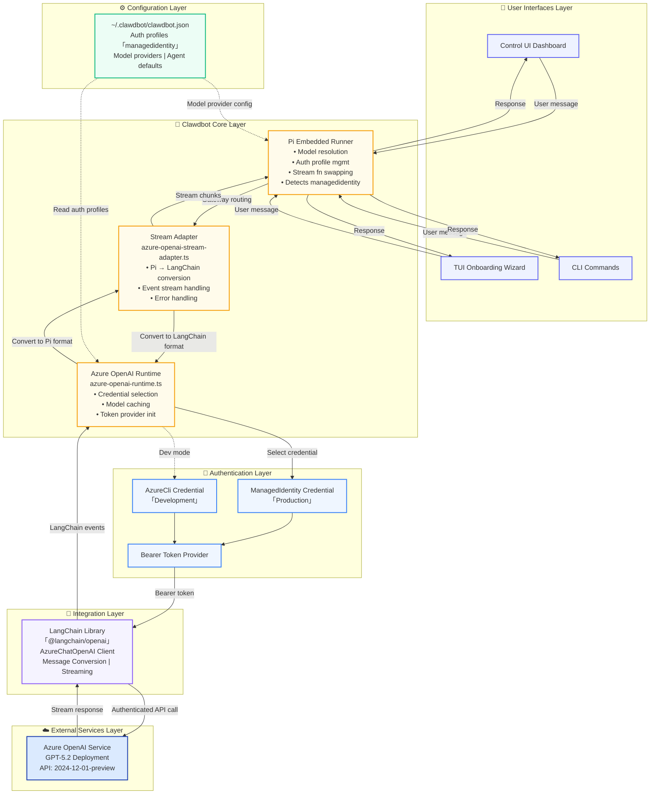

# Azure OpenAI Managed Identity System Architecture - Mermaid Diagram

## Architecture Overview

This diagram shows the **Azure OpenAI Managed Identity integration** within the Clawdbot system, organized into 6 distinct layers:

### 📊 Data Flow Path
1. **User message** enters via UI (Dashboard/TUI/CLI)
2. **Gateway** routes to Pi Embedded Runner
3. **Runner** forwards to Stream Adapter
4. **Adapter** converts Pi format → LangChain format
5. **Runtime** selects credential (ManagedIdentity in prod, AzureCli in dev)
6. **Authentication** layer provides Bearer token
7. **LangChain** makes authenticated API call to Azure
8. **Azure OpenAI** streams response back through the stack
9. **Response** converted back to Pi format and delivered to user

### 🔑 Key Components

- **ManagedIdentity Credential**: Production authentication (no keys required)
- **AzureCli Credential**: Development authentication (uses `az login`)
- **Bearer Token Provider**: Converts Azure credentials to OpenAI bearer tokens
- **Stream Adapter**: Bidirectional format conversion between Pi and LangChain
- **Runtime**: Manages credential selection, model caching, and token initialization

### 📝 Configuration

All settings managed via `~/.clawdbot/clawdbot.json`:
- Auth profiles (including `managedidentity`)
- Model provider configurations
- Agent defaults
