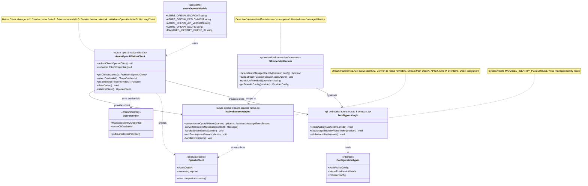

# Azure OpenAI Native Client - Class Design Diagram



## Class Design Overview

This diagram shows the **Azure OpenAI Native Client class structure** - using direct Azure OpenAI SDK integration **without LangChain**.

### Core Classes

#### 1. AzureOpenAIModels (Constants)
**File:** `src/agents/azure-openai-models.ts`

Configuration constants:
- `AZURE_OPENAI_ENDPOINT`: Azure OpenAI service endpoint
- `AZURE_OPENAI_DEPLOYMENT`: Model deployment name
- `AZURE_OPENAI_API_VERSION`: API version (2024-12-01-preview)
- `AZURE_OPENAI_SCOPE`: OAuth scope for authentication
- `MANAGED_IDENTITY_CLIENT_ID`: Client ID for managed identity

---

#### 2. AzureOpenAINativeClient (Native Client Manager)
**File:** `src/agents/azure-openai-native-client.ts`

**Purpose:** Manages native OpenAI client lifecycle without LangChain

**Key Methods:**
- `getClientInstance()`: Returns cached or creates new OpenAI client
- `selectCredential()`: Chooses ManagedIdentity (prod) or AzureCli (dev)
- `createBearerTokenProvider()`: Converts Azure credential to bearer token
- `clearCache()`: Clears cache for testing
- `initializeClient()`: Creates new OpenAI client

**Process:**
1. Check cache
2. Select credential based on NODE_ENV
3. Create bearer token provider
4. Initialize native AzureOpenAI client
5. Cache and return

---

#### 3. NativeStreamAdapter (Stream Handler)
**File:** `src/agents/azure-openai-stream-adapter-native.ts`

**Purpose:** Adapts native OpenAI streaming to Pi format

**Key Methods:**
- `streamAzureOpenAINative()`: Main streaming function
- `convertContextToMessages()`: Pi → Native OpenAI format
- `handleStreamEvents()`: Process streaming chunks
- `emitEvents()`: Emit Pi events
- `handleErrors()`: Error handling

**Process:**
1. Create event stream
2. Get native client
3. Convert Pi context to native messages
4. Stream from `chat.completions.create()`
5. Emit Pi-compatible events
6. Handle errors

---

#### 4. PiEmbeddedRunner (Detection & Routing)
**File:** `pi-embedded-runner/run/attempt.ts`

**Purpose:** Detects managed identity and routes to native streaming

**Detection Logic:**
```typescript
normalizedProvider = normalizeProviderId(provider)
providerConfig = config.models.providers[provider]
usesAzureManagedIdentity =
  normalizedProvider === 'azureopenai' &&
  providerConfig.auth === 'managedidentity'

if (usesAzureManagedIdentity) {
  activeSession.agent.streamFn = streamAzureOpenAINative
} else {
  activeSession.agent.streamFn = streamSimple
}
```

---

#### 5. AuthBypassLogic (API Key Bypass)
**File:** `pi-embedded-runner/run.ts` & `compact.ts`

**Purpose:** Bypasses API key requirement for managed identity

**Key Logic:**
```typescript
if (!apiKeyInfo.apiKey) {
  if (mode !== 'aws-sdk' && mode !== 'managedidentity') {
    throw Error('No API key')
  }

  if (mode === 'managedidentity') {
    authStorage.setRuntimeApiKey(
      provider,
      'MANAGED_IDENTITY_PLACEHOLDER'
    )
  }
}
```

---

#### 6. ConfigurationTypes (Type Definitions)
**Files:** Various type definition files

**Key Types:**
- `AuthProfileConfig`: { mode, provider }
- `ModelProviderAuthMode`: 'managedidentity' | 'api-key' | 'aws-sdk' | 'oauth' | 'token'
- `ProviderConfig`: { auth, baseUrl, api }

---

### External Dependencies

#### 7. AzureIdentity (@azure/identity)
- `ManagedIdentityCredential(clientId)`: Production auth (no keys!)
- `AzureCliCredential()`: Development auth (`az login`)
- `getBearerTokenProvider(credential, scope)`: Token provider

#### 8. OpenAIClient (@azure/openai)
- `AzureOpenAI(config)`: Native OpenAI client
- `chat.completions.create()`: Chat API
- Native streaming support
- Direct API integration

---

## Key Differences from LangChain

### Removed:
- `@langchain/openai` dependency
- `AzureChatOpenAI` wrapper
- LangChain message types
- Intermediate conversion layers

### Added:
- Direct `@azure/openai` SDK usage
- Native OpenAI message format
- Simplified architecture

### Benefits:
- Fewer dependencies
- Better performance
- Simpler code
- Smaller bundle size

---

## Data Flow

```
User Request
    ↓
PiEmbeddedRunner (detects managedidentity)
    ↓
NativeStreamAdapter (converts format)
    ↓
NativeClient (selects credential)
    ↓
AzureIdentity (provides token)
    ↓
OpenAIClient (native streaming)
    ↓
NativeStreamAdapter (emits events)
    ↓
User Response
```

---

## Authentication

### Production (Managed Identity):
1. Detect NODE_ENV=production
2. Create ManagedIdentityCredential(clientId)
3. Call getBearerTokenProvider(credential, scope)
4. Initialize AzureOpenAI
5. No API keys needed!

### Development (Azure CLI):
1. Detect NODE_ENV=development
2. Create AzureCliCredential()
3. Use tokens from `az login`
4. Call getBearerTokenProvider(credential, scope)
5. Initialize AzureOpenAI

---

## Configuration Example

```json
{
  "models": {
    "providers": {
      "azureopenai": {
        "auth": "managedidentity",
        "baseUrl": "https://your-instance.openai.azure.com",
        "api": "2024-12-01-preview"
      }
    }
  }
}
```
