# Azure OpenAI - Class Design Diagram (Mermaid)

```mermaid
classDiagram
    %% Define classes
    class AzureOpenAIModels {
        <<constants>>
        +AZURE_OPENAI_ENDPOINT string
        +AZURE_OPENAI_DEPLOYMENT string
        +AZURE_OPENAI_API_VERSION string
        +AZURE_OPENAI_SCOPE string
        +MANAGED_IDENTITY_CLIENT_ID string
    }

    class AzureOpenAIRuntime {
        <<azure-openai-runtime.ts>>
        -cachedModel AzureChatOpenAI | null
        +getAzureOpenAIModelInstance() Promise~AzureChatOpenAI~
        +clearAzureOpenAICache() void
    }

    class AzureOpenAIStreamAdapter {
        <<azure-openai-stream-adapter.ts>>
        +streamAzureOpenAIManagedIdentity(context, options) AssistantMessageEventStream
        -convertPiToLangChainMessages(context) Message[]
        -emitStreamEvents(stream) void
        -handleErrors(error) void
    }

    class PiEmbeddedRunner {
        <<pi-embedded-runner/run/attempt.ts>>
        +detectAzureManagedIdentity(provider, config) boolean
        +swapStreamFunction(session, usesAzure) void
    }

    class AuthBypassLogic {
        <<pi-embedded-runner/run.ts & compact.ts>>
        +checkApiKey(apiKeyInfo, mode) void
        +setManagedIdentityPlaceholder(provider) void
    }

    class ConfigurationTypes {
        <<interface>>
        +AuthProfileConfig
        +ModelProviderAuthMode
        +ProviderConfig
    }

    class ExternalDependencies {
        <<@azure/identity & @langchain/openai>>
        +ManagedIdentityCredential
        +AzureCliCredential
        +getBearerTokenProvider
        +AzureChatOpenAI
        +Message Types
    }

    %% Relationships
    AzureOpenAIModels ..> AzureOpenAIRuntime : uses
    AzureOpenAIRuntime --> AzureOpenAIStreamAdapter : calls
    AzureOpenAIRuntime ..> ExternalDependencies : uses Azure libs
    AzureOpenAIStreamAdapter ..> ExternalDependencies : uses LangChain
    PiEmbeddedRunner ..> AzureOpenAIStreamAdapter : swaps to
    PiEmbeddedRunner --> AuthBypassLogic : bypasses
    AuthBypassLogic ..> ConfigurationTypes : reads
    AzureOpenAIRuntime --> AuthBypassLogic : provides creds

    %% Notes
    note for AzureOpenAIRuntime "1. Checks cache first\n2. Selects credential (NODE_ENV)\n3. Creates bearer token provider\n4. Initializes AzureChatOpenAI\n5. Caches model instance"

    note for AzureOpenAIStreamAdapter "Process:\n1. Create eventStream\n2. Get model instance\n3. Convert Pi → LangChain messages\n4. Configure model\n5. Stream from LangChain\n6. Emit events\n7. Handle errors"

    note for PiEmbeddedRunner "Detection Logic:\nnormalizedProvider === 'azureopenai' &&\nproviderConfig.auth === 'managedidentity'"

    note for AuthBypassLogic "Sets MANAGED_IDENTITY_PLACEHOLDER\nwhen mode === 'managedidentity'"

    %% Styling
    class AzureOpenAIModels {
        fill:#dbeafe
        stroke:#1e40af
    }
    class AzureOpenAIRuntime {
        fill:#fffbeb
        stroke:#f59e0b
    }
    class AzureOpenAIStreamAdapter {
        fill:#f5f3ff
        stroke:#8b5cf6
    }
    class PiEmbeddedRunner {
        fill:#ecfdf5
        stroke:#10b981
    }
    class AuthBypassLogic {
        fill:#eff6ff
        stroke:#3b82f6
    }
    class ConfigurationTypes {
        fill:#eef2ff
        stroke:#6366f1
    }
    class ExternalDependencies {
        fill:#fee2e2
        stroke:#dc2626
    }
```

## Class Design Overview

This diagram shows the **Azure OpenAI integration class structure** with 7 main components:

### 🔵 Core Classes

#### 1. **AzureOpenAIModels** (Constants)
- Configuration constants for Azure OpenAI endpoint, deployment, API version, scope, and managed identity client ID

#### 2. **AzureOpenAIRuntime** (Runtime Engine)
- Manages model instance lifecycle with caching
- Selects credentials based on environment (production/development)
- Creates bearer token provider and initializes LangChain client
- **Key Methods:**
  - `getAzureOpenAIModelInstance()`: Returns cached or new model instance
  - `clearAzureOpenAICache()`: Clears the cache

#### 3. **AzureOpenAIStreamAdapter** (Stream Handler)
- Main streaming function that bridges Pi and LangChain
- Converts Pi context to LangChain message types (SystemMessage, HumanMessage, AIMessage, ToolMessage)
- Emits stream events: start, text_start, text_delta, text_end, done
- Handles errors gracefully

#### 4. **PiEmbeddedRunner** (Detection & Routing)
- Detects when Azure Managed Identity should be used
- Dynamically swaps stream function based on provider configuration
- **Logic:** If provider is `azureopenai` AND auth is `managedidentity`, use custom stream function

#### 5. **AuthBypassLogic** (API Key Bypass)
- Handles special case where managed identity doesn't need API keys
- Sets placeholder value when managed identity mode is active
- Throws errors for modes that require API keys but don't have them

#### 6. **ConfigurationTypes** (Type Definitions)
- TypeScript interfaces for configuration
- Supports multiple auth modes: `managedidentity`, `api-key`, `aws-sdk`, `oauth`, `token`

#### 7. **ExternalDependencies** (Azure & LangChain Libraries)
- **@azure/identity:** ManagedIdentityCredential, AzureCliCredential, getBearerTokenProvider
- **@langchain/openai:** AzureChatOpenAI, Message types

### 🔗 Relationships

- **Uses:** Models → Runtime (configuration constants)
- **Calls:** Runtime → Adapter (gets model instance)
- **Swaps to:** Runner → Adapter (dynamic function routing)
- **Bypasses:** Runner → Auth Bypass (skips API key check)
- **Reads:** Auth Bypass → Config Types (validates auth mode)
- **Provides creds:** Runtime → Auth Bypass (credential objects)
- **Uses libs:** Runtime & Adapter → External Dependencies (Azure SDK & LangChain)

### 📝 Key Flows

1. **Model Instance Creation:** Models → Runtime → External Dependencies
2. **Stream Execution:** Runner → Adapter → Runtime → External Dependencies
3. **Auth Handling:** Runner → Auth Bypass → Config Types
