# Azure OpenAI vs Anthropic - Architecture Comparison

```mermaid
graph TB
    subgraph "Azure OpenAI Flow (Managed Identity)"
        U1[User Request] --> G1[Gateway]
        G1 --> R1[PiEmbeddedRunner]
        R1 --> D1{Detect Provider}
        D1 -->|azureopenai + managedidentity| A1[Azure Native Client]
        A1 --> MI[Managed Identity Credential]
        MI --> BTP[Bearer Token Provider]
        BTP --> AZ[Azure OpenAI Client]
        AZ --> ASA[Native Stream Adapter]
        ASA --> AZAPI[Azure OpenAI API]
        AZAPI --> ASA
        ASA --> R1
        R1 --> G1
        G1 --> U1[User Response]
    end

    subgraph "Anthropic Flow (API Key/Token)"
        U2[User Request] --> G2[Gateway]
        G2 --> R2[PiEmbeddedRunner]
        R2 --> D2{Detect Provider}
        D2 -->|anthropic| AP[AuthProfiles]
        AP -->|Load Credential| AK[API Key/Token]
        AK --> SA[Default Stream Adapter]
        SA -->|Optional| PL[Payload Logger]
        PL --> ANAPI[Anthropic API]
        ANAPI --> PL
        PL --> SA
        SA --> R2
        R2 --> G2
        G2 --> U2[User Response]
    end

    style MI fill:#0078d4,color:#fff
    style BTP fill:#0078d4,color:#fff
    style AZ fill:#0078d4,color:#fff
    style ASA fill:#0078d4,color:#fff
    style AZAPI fill:#0078d4,color:#fff

    style AP fill:#d97706,color:#fff
    style AK fill:#d97706,color:#fff
    style SA fill:#d97706,color:#fff
    style PL fill:#d97706,color:#fff
    style ANAPI fill:#d97706,color:#fff
```



---

## Architecture Comparison Table

| Component | Azure OpenAI | Anthropic |
|-----------|--------------|-----------|
| **Auth Method** | Managed Identity / Azure CLI | API Key / Setup Token / OAuth |
| **Credential Provider** | @azure/identity | Auth Profiles (direct key/token) |
| **Token Management** | Bearer token provider (auto-refresh) | Static API key/token |
| **Client SDK** | @azure/openai (native) | @anthropic-ai/sdk (via Pi AI) |
| **Stream Adapter** | Custom (streamAzureOpenAINative) | Default (streamSimple) |
| **Detection Logic** | `provider === 'azureopenai' && auth === 'managedidentity'` | `provider === 'anthropic'` (any auth) |
| **Integration Type** | Custom native integration | Standard Pi AI integration |
| **Payload Logging** | No | Yes (optional) |
| **Dependencies** | +2 (azure/identity, azure/openai) | 0 (uses existing Pi AI) |
| **Code Complexity** | High (custom adapter) | Low (standard integration) |

---

## Detailed Component Comparison

### 1. Authentication

#### Azure OpenAI (Managed Identity)
```typescript
// Step 1: Select credential
const credential = NODE_ENV === 'production'
  ? new ManagedIdentityCredential(clientId)
  : new AzureCliCredential()

// Step 2: Create bearer token provider
const tokenProvider = getBearerTokenProvider(
  credential,
  'https://cognitiveservices.azure.com/.default'
)

// Step 3: Initialize client
const client = new AzureOpenAI({
  endpoint: AZURE_OPENAI_ENDPOINT,
  azureADTokenProvider: tokenProvider,
  apiVersion: AZURE_OPENAI_API_VERSION,
})
```

**Advantages:**
- ✅ Keyless authentication (no secrets in code)
- ✅ Automatic token rotation
- ✅ Azure AD integration
- ✅ Enterprise-grade security

**Disadvantages:**
- ❌ Complex setup (Azure IAM, RBAC)
- ❌ Azure-specific (vendor lock-in)
- ❌ Requires Azure infrastructure

---

#### Anthropic (API Key/Token)
```typescript
// Step 1: Load credential
const credential = loadAuthProfile('anthropic:token:default')

// Step 2: Use directly
const apiKey = credential.token || process.env.ANTHROPIC_API_KEY

// Step 3: Call API (via Pi AI streamSimple)
// SDK handles auth automatically
```

**Advantages:**
- ✅ Simple setup (just API key/token)
- ✅ Cloud-agnostic
- ✅ Easy to test and debug
- ✅ Multiple auth modes (API key, token, OAuth)

**Disadvantages:**
- ❌ API key management (manual rotation)
- ❌ Secrets in environment/config
- ❌ No automatic refresh

---

### 2. Stream Adapter

#### Azure OpenAI (Custom Native Adapter)
```typescript
// Custom adapter to fix tool arguments bug
export async function streamAzureOpenAINative(
  context: AgentMessage[],
  options?: StreamOptions,
): Promise<AssistantMessageEventStream> {
  const eventStream = new AssistantMessageEventStream()

  try {
    // 1. Get native client
    const client = await getClientInstance()

    // 2. Convert Pi format → Native OpenAI format
    const messages = convertContextToMessages(context)

    // 3. Create streaming request
    const stream = await client.chat.completions.create({
      model: AZURE_OPENAI_DEPLOYMENT,
      messages,
      stream: true,
    })

    // 4. Handle stream events
    for await (const chunk of stream) {
      emitEvents(eventStream, chunk)
    }

    return eventStream
  } catch (error) {
    handleErrors(error)
  }
}
```

**Purpose:** Fix empty tool arguments bug in LangChain
**Complexity:** High (custom event handling)
**Maintenance:** Requires updates when Pi AI changes

---

#### Anthropic (Default Adapter)
```typescript
// Use default streamSimple from @mariozechner/pi-ai
import { streamSimple } from '@mariozechner/pi-ai'

// No custom adapter needed!
activeSession.agent.streamFn = streamSimple

// Optional: Wrap for logging
if (loggingEnabled) {
  activeSession.agent.streamFn = logger.wrapStreamFn(streamSimple)
}
```

**Purpose:** Standard Pi AI integration (no custom code)
**Complexity:** Low (uses library)
**Maintenance:** Automatic (library handles updates)

---

### 3. Detection & Routing

#### Azure OpenAI
```typescript
const normalizedProvider = normalizeProviderId(provider)
const providerConfig = config.models.providers[normalizedProvider]

const usesAzureManagedIdentity =
  normalizedProvider === 'azureopenai' &&
  providerConfig.auth === 'managedidentity'

if (usesAzureManagedIdentity) {
  // Use custom native adapter
  activeSession.agent.streamFn = streamAzureOpenAINative
} else {
  // Use default
  activeSession.agent.streamFn = streamSimple
}
```

**Trigger:** Specific provider + specific auth mode
**Adapter:** Custom native adapter
**Complexity:** Conditional routing logic

---

#### Anthropic
```typescript
const normalizedProvider = normalizeProviderId(provider)

// Always use default (no special case)
activeSession.agent.streamFn = streamSimple

// Optional: Add logging wrapper
if (shouldLogAnthropicPayload(provider)) {
  const logger = createAnthropicPayloadLogger(params)
  activeSession.agent.streamFn = logger.wrapStreamFn(streamSimple)
}
```

**Trigger:** Any Anthropic provider (any auth mode)
**Adapter:** Default Pi AI adapter
**Complexity:** Simple (no conditional routing)

---

### 4. Payload Logging

#### Azure OpenAI
❌ **Not available**

---

#### Anthropic
✅ **Optional via environment variable**

```typescript
// Enable logging
export CLAWDBOT_ANTHROPIC_PAYLOAD_LOG=true
export CLAWDBOT_ANTHROPIC_PAYLOAD_LOG_FILE=/logs/anthropic-payload.jsonl

// Logger wraps streamFn
const logger = createAnthropicPayloadLogger({
  runId, sessionId, provider, modelId, workspaceDir
})

const wrappedStreamFn = logger.wrapStreamFn(streamSimple)

// Logs request payloads and usage
{
  "ts": "2026-02-09T20:00:00.000Z",
  "stage": "request",
  "payload": { ... },
  "payloadDigest": "sha256_hash"
}

{
  "ts": "2026-02-09T20:00:05.000Z",
  "stage": "usage",
  "usage": { input_tokens: 456, output_tokens: 123 }
}
```

**Benefits:**
- Debug API issues
- Track token usage
- Audit requests
- Monitor errors

---

## File Structure Comparison

### Azure OpenAI Files
```
src/agents/
├── azure-openai-models.ts              # Constants
├── azure-openai-native-client.ts       # Native client manager
├── azure-openai-stream-adapter-native.ts  # Custom stream adapter
└── pi-embedded-runner/
    └── run/
        └── attempt.ts                  # Detection & routing
```

**Total Custom Code:** ~500 lines

---

### Anthropic Files
```
src/agents/
├── anthropic-payload-log.ts            # Optional payload logger
└── pi-embedded-runner/
    └── run/
        └── attempt.ts                  # Standard routing

src/commands/
└── auth-choice.apply.anthropic.ts      # Auth management
```

**Total Custom Code:** ~300 lines (mostly logging, which is optional)

---

## Configuration Comparison

### Azure OpenAI Config
```json
{
  "models": {
    "providers": {
      "azureopenai": {
        "auth": "managedidentity",
        "baseUrl": "https://your-instance.openai.azure.com",
        "api": "2024-12-01-preview",
        "deployment": "gpt-4",
        "managedIdentityClientId": "..."
      }
    }
  }
}
```

**Environment Variables:**
```bash
export AZURE_OPENAI_ENDPOINT=https://...
export AZURE_OPENAI_DEPLOYMENT=gpt-4
export AZURE_OPENAI_API_VERSION=2024-12-01-preview
export AZURE_OPENAI_SCOPE=https://cognitiveservices.azure.com/.default
export MANAGED_IDENTITY_CLIENT_ID=...
```

---

### Anthropic Config
```json
{
  "models": {
    "providers": {
      "anthropic": {
        "auth": "token",
        "baseUrl": "https://api.anthropic.com",
        "api": "anthropic-messages"
      }
    }
  }
}
```

**Environment Variables:**
```bash
export ANTHROPIC_API_KEY=sk-ant-api03-...

# Optional logging
export CLAWDBOT_ANTHROPIC_PAYLOAD_LOG=true
export CLAWDBOT_ANTHROPIC_PAYLOAD_LOG_FILE=/logs/anthropic.jsonl
```

---

## Pros & Cons Summary

### Azure OpenAI (Managed Identity)

**Pros:**
- ✅ Keyless authentication (most secure)
- ✅ Automatic token rotation
- ✅ Enterprise-grade security
- ✅ Azure AD integration
- ✅ RBAC support
- ✅ Audit logs via Azure

**Cons:**
- ❌ Complex setup (IAM, RBAC)
- ❌ Azure vendor lock-in
- ❌ Requires Azure infrastructure
- ❌ Custom adapter maintenance
- ❌ More dependencies
- ❌ Higher code complexity

**Best For:**
- Enterprise Azure deployments
- Zero-trust security requirements
- Regulated industries (finance, healthcare)
- Large teams with dedicated Azure admins

---

### Anthropic (API Key/Token)

**Pros:**
- ✅ Simple setup (just API key)
- ✅ Cloud-agnostic
- ✅ Easy to test and debug
- ✅ Standard Pi AI integration
- ✅ Fewer dependencies
- ✅ Optional payload logging
- ✅ Multiple auth modes

**Cons:**
- ❌ API key management (manual rotation)
- ❌ Secrets in environment/config
- ❌ No automatic token refresh
- ❌ Limited enterprise IAM integration

**Best For:**
- General-purpose AI integration
- Rapid development
- Multi-cloud deployments
- Small to medium teams
- Projects without Azure infrastructure

---

## When to Use Which?

### Choose Azure OpenAI if:
1. You're already on Azure infrastructure
2. You need keyless authentication
3. You have enterprise security requirements
4. You need Azure AD integration
5. You have dedicated Azure admins

### Choose Anthropic if:
1. You want simple, cloud-agnostic integration
2. You're not on Azure infrastructure
3. You want rapid development
4. You need flexibility (multi-cloud, local dev)
5. You want to minimize dependencies

---

## Migration Path

### From Anthropic to Azure OpenAI:
1. Set up Azure infrastructure (Resource Group, OpenAI resource)
2. Configure Managed Identity (assign RBAC roles)
3. Add Azure dependencies (`@azure/identity`, `@azure/openai`)
4. Implement custom stream adapter
5. Update detection logic in PiEmbeddedRunner
6. Test with Azure CLI credentials (dev)
7. Deploy with Managed Identity (prod)

### From Azure OpenAI to Anthropic:
1. Generate Anthropic API key or setup-token
2. Store in auth profile or environment variable
3. Update provider config (change auth mode)
4. Remove Azure-specific code (if desired)
5. Remove Azure dependencies (optional)
6. Test with standard Pi AI integration

---

## Hybrid Approach

You can support **both** Azure OpenAI and Anthropic in the same application:

```typescript
const normalizedProvider = normalizeProviderId(provider)
const providerConfig = config.models.providers[normalizedProvider]

if (normalizedProvider === 'azureopenai' && providerConfig.auth === 'managedidentity') {
  // Use custom Azure adapter
  activeSession.agent.streamFn = streamAzureOpenAINative
} else if (normalizedProvider === 'anthropic' && loggingEnabled) {
  // Use default adapter with logging
  const logger = createAnthropicPayloadLogger(params)
  activeSession.agent.streamFn = logger.wrapStreamFn(streamSimple)
} else {
  // Use default adapter
  activeSession.agent.streamFn = streamSimple
}
```

**Benefits:**
- Flexibility: Use Azure in production, Anthropic in dev
- Vendor diversity: Avoid single-vendor lock-in
- Failover: Switch providers if one is down
- Cost optimization: Use cheaper provider for non-critical tasks

---

## Conclusion

Both architectures serve different needs:

- **Azure OpenAI**: Enterprise-grade, keyless, complex
- **Anthropic**: Simple, flexible, developer-friendly

Choose based on your **security requirements, infrastructure, and team expertise**.
