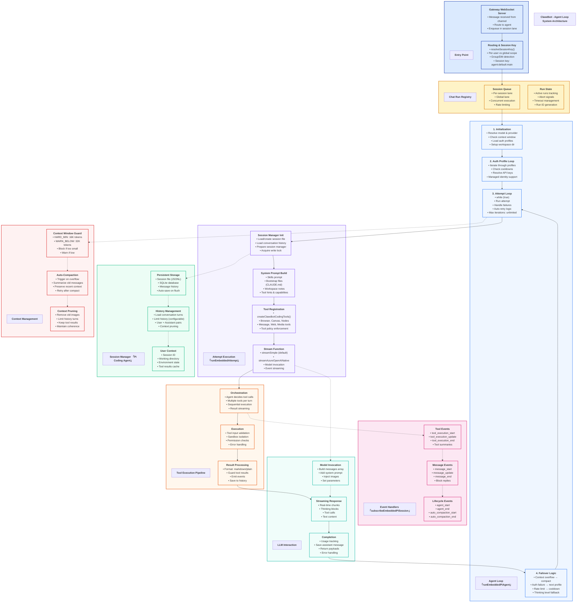

# Clawdbot - Agent Loop Architecture



## Architecture Overview

Clawdbot's Agent Loop is a sophisticated multi-layer system that processes user messages through a series of coordinated components, from message ingestion to LLM response generation and tool execution.

---

## Layer 1: Entry Point

### Gateway WebSocket Server
**File:** `src/gateway/server.ts`

**Purpose:** Accept incoming messages from various channels

**Process:**
1. Message received from channel (WhatsApp, Telegram, etc.)
2. Authentication & validation
3. Route to appropriate agent
4. Enqueue in session-specific lane

### Routing & Session Key
**File:** `src/config/sessions/session-key.ts`

**Purpose:** Determine which conversation session to use

**Key Functions:**
- `resolveSessionKey()` - Maps user/channel to session
- Scope types: `per-sender`, `global`, `per-group`
- Session key format: `agent:default:main` (direct messages)
- Group format: `agent:default:group:123`

---

## Layer 2: Chat Run Registry

### Session Queue
**File:** `src/gateway/server-chat.ts`

**Purpose:** Manage concurrent agent runs per session

**Features:**
- **Per-session lane** - One agent run per user at a time
- **Global lane** - Cross-session rate limiting
- **Concurrent execution** - Multiple users simultaneously
- **Queue management** - FIFO processing per session

### Run State
**Purpose:** Track active agent runs

**Tracking:**
- Active run IDs
- Abort signals for cancellation
- Timeout management (configurable per run)
- Run metadata (provider, model, session)

---

## Layer 3: Agent Loop Core

### Main Loop: `runEmbeddedPiAgent()`
**File:** `src/agents/pi-embedded-runner/run.ts`

**Process Flow:**

#### 1. Initialization
```typescript
// Resolve model and provider
const { model, authStorage, modelRegistry } = resolveModel(provider, modelId, ...)

// Context window validation
const ctxGuard = evaluateContextWindowGuard({
  info: ctxInfo,
  warnBelowTokens: 32000,  // CONTEXT_WINDOW_WARN_BELOW_TOKENS
  hardMinTokens: 16000,     // CONTEXT_WINDOW_HARD_MIN_TOKENS
})

// Setup workspace
await fs.mkdir(resolvedWorkspace, { recursive: true })
```

#### 2. Auth Profile Loop
```typescript
// Iterate through auth profiles
const profileOrder = resolveAuthProfileOrder({ cfg, store, provider })
let profileIndex = 0

while (profileIndex < profileCandidates.length) {
  const candidate = profileCandidates[profileIndex]

  // Check cooldown (rate limiting)
  if (isProfileInCooldown(authStore, candidate)) {
    profileIndex++
    continue
  }

  // Apply API key or managed identity
  await applyApiKeyInfo(candidate)
  break
}
```

**Auth Modes:**
- `api-key` - Standard API key
- `managedidentity` - Azure Managed Identity
- `oauth` - OAuth 2.0 flow
- `token` - Bearer token
- `aws-sdk` - AWS credentials

#### 3. Attempt Loop
```typescript
while (true) {
  // Run single attempt
  const attempt = await runEmbeddedAttempt({
    sessionId, provider, modelId, prompt, ...
  })

  const { aborted, promptError, lastAssistant } = attempt

  // Handle errors and retry logic
  if (promptError) {
    // Context overflow → auto-compaction
    if (isContextOverflowError(errorText)) {
      if (!overflowCompactionAttempted) {
        await compactEmbeddedPiSessionDirect(...)
        continue  // Retry
      }
    }

    // Auth failure → advance to next profile
    if (isFailoverErrorMessage(errorText)) {
      if (await advanceAuthProfile()) {
        continue  // Retry with new profile
      }
    }

    // Unsupported thinking level → fallback
    const fallbackThinking = pickFallbackThinkingLevel(...)
    if (fallbackThinking) {
      thinkLevel = fallbackThinking
      continue  // Retry with different thinking
    }
  }

  // Success or unrecoverable error
  break
}
```

#### 4. Failover Logic

**Error Classification:**
- `auth` - Authentication failure → next profile
- `rate_limit` - Rate limit → cooldown + next profile
- `billing` - Billing issue → next profile
- `timeout` - Request timeout → retry or fail
- `format` - Invalid format → adjust and retry
- `context_overflow` - Too large → compact
- `compaction_failure` - Compact failed → error

**Failover Hierarchy:**
1. **Thinking level fallback** - Try different thinking mode
2. **Auth profile rotation** - Switch to next available profile
3. **Auto-compaction** - Reduce context size
4. **Model fallback** - Switch to different model (if configured)

---

## Layer 4: Attempt Execution

### Single Attempt: `runEmbeddedAttempt()`
**File:** `src/agents/pi-embedded-runner/run/attempt.ts`

**Process:**

#### 1. Session Manager Initialization
```typescript
// Load or create session
const sessionFile = resolveSessionFile(...)
const hadSessionFile = await fileExists(sessionFile)

// Create session manager
const sessionManager = createAgentSession({
  sessionFile,
  historyEventStream: agent.historyStream,
  maxHistoryEntries: undefined,  // No hard limit
  autoSave: true,
})

// Prepare for first run
await prepareSessionManagerForRun({
  sessionManager,
  sessionFile,
  hadSessionFile,
  sessionId,
  cwd,
})

// Acquire write lock (prevent concurrent writes)
const releaseLock = await acquireSessionWriteLock(sessionFile)
```

#### 2. System Prompt Construction
```typescript
const systemPrompt = buildEmbeddedSystemPrompt({
  // Skills
  skillsPrompt: resolveSkillsPromptForRun(...),

  // Bootstrap files
  bootstrapFiles: [
    { name: 'CLAUDE.md', content: '...' },
    { name: 'README.md', content: '...' }
  ],

  // Workspace context
  workspaceDir: effectiveWorkspace,
  workspaceNotes: ['Reminder: commit your changes...'],

  // Tool hints
  channelCapabilities: resolveChannelCapabilities(...),
  supportedActions: listChannelSupportedActions(...),

  // Other context
  machineDisplayName: getMachineDisplayName(),
  sandboxInfo: buildEmbeddedSandboxInfo(...),
})
```

#### 3. Tool Registration
```typescript
const tools = createClawdbotCodingTools({
  // Core tools
  browser: browserTool,
  canvas: canvasTool,
  nodes: nodesTool,

  // Communication
  message: messageTool,
  web_search: webSearchTool,
  web_fetch: webFetchTool,

  // Media
  image: imageTool,
  audio: audioTool,
  video: videoTool,

  // System
  cron: cronTool,
  session: sessionTool,
  skills: skillsTool,
})

// Tool policy enforcement
const guardedTools = applyToolPolicy(tools, toolPolicy)
```

#### 4. Stream Function Selection
```typescript
// Detect Azure Managed Identity
const normalizedProvider = normalizeProviderId(provider)
const providerConfig = config.models.providers[provider]
const usesAzureManagedIdentity =
  normalizedProvider === 'azureopenai' &&
  providerConfig.auth === 'managedidentity'

// Swap stream function
if (usesAzureManagedIdentity) {
  activeSession.agent.streamFn = streamAzureOpenAINative
} else {
  activeSession.agent.streamFn = streamSimple
}
```

---

## Layer 5: Session Manager

### Pi Coding Agent SessionManager
**Library:** `@mariozechner/pi-coding-agent`

### Persistent Storage

**Session File Format (JSONL):**
```json
{"type":"session","id":"agent:default:main","cwd":"/workspace"}
{"type":"message","message":{"role":"user","content":"Hello"}}
{"type":"message","message":{"role":"assistant","content":"Hi!"}}
{"type":"tool_result","tool":"bash","result":"output"}
```

**Storage Locations:**
- Session files: `~/.clawdbot/sessions/`
- SQLite database: `~/.clawdbot/sessions.db`
- Transcript archives: `~/.clawdbot/transcripts/`

### History Management

**Configuration:**
```typescript
{
  historyLimit: 50,          // Max user turns (0 = unlimited)
  historyLimitDM: 100,       // DM-specific limit
  historyLimitGroup: 30,     // Group chat limit
}
```

**History Loading:**
```typescript
// Load conversation history
const messages = sessionManager.getMessages()

// Limit history turns
const limitedMessages = limitHistoryTurns(messages, {
  limit: historyLimit,
  provider: normalizedProvider,
})
```

### User Context

**Session State:**
- **Session ID** - Unique identifier
- **Working Directory** - Current workspace path
- **Environment Variables** - Skill env overrides
- **Tool Results Cache** - Recent tool outputs
- **Image Attachments** - Image history by index

---

## Layer 6: Tool Execution Pipeline

### Orchestration
**File:** `src/agents/pi-embedded-subscribe.handlers.tools.ts`

**Process:**
1. **Agent decides tool calls** - LLM outputs tool_use blocks
2. **Multiple tools per turn** - Agent can call multiple tools
3. **Sequential execution** - Tools execute in order
4. **Result streaming** - Results stream back to agent

### Execution
**File:** `src/agents/pi-tools.ts`

**Features:**
- **Tool input validation** - TypeBox schema validation
- **Sandbox isolation** - Optional sandboxed execution
- **Permission checks** - Tool policy enforcement
- **Error handling** - Graceful error recovery

**Tool Call Example:**
```typescript
{
  type: 'tool_use',
  id: 'toolu_01ABC123',
  name: 'bash',
  input: {
    command: 'ls -la',
    description: 'List files'
  }
}
```

### Result Processing

**Formats:**
- `markdown` - Rich formatting with code blocks
- `plain` - Plain text for simple channels

**Guarding:**
```typescript
// Guard tool results (size limits, content filtering)
const guardedResult = guardToolResult(result, {
  maxSize: 100000,  // 100KB
  truncate: true,
})
```

**Event Emission:**
```typescript
// Emit tool events
ctx.emit({
  type: 'tool_execution_start',
  toolName: 'bash',
  toolId: 'toolu_01ABC123',
})

ctx.emit({
  type: 'tool_execution_end',
  toolName: 'bash',
  toolId: 'toolu_01ABC123',
  result: guardedResult,
})
```

---

## Layer 7: Event Handlers

### Event System: `subscribeEmbeddedPiSession()`
**File:** `src/agents/pi-embedded-subscribe.ts`

### Lifecycle Events

**Events:**
- `agent_start` - Agent run begins
- `agent_end` - Agent run completes
- `auto_compaction_start` - Compaction begins
- `auto_compaction_end` - Compaction completes

**Handlers:**
```typescript
function handleAgentStart(ctx: Context) {
  ctx.emit({ type: 'agent_start' })
  // Show typing indicator
  // Log run start
}

function handleAgentEnd(ctx: Context) {
  ctx.emit({ type: 'agent_end' })
  // Hide typing indicator
  // Log run completion
}
```

### Message Events

**Events:**
- `message_start` - Assistant message starts
- `message_update` - Partial content received
- `message_end` - Message complete

**Block Replies:**
- Stream partial replies in chunks
- Configurable chunking strategy
- Break on natural boundaries (sentences, paragraphs)

### Tool Events

**Events:**
- `tool_execution_start` - Tool execution begins
- `tool_execution_update` - Streaming tool output
- `tool_execution_end` - Tool execution completes

**Tool Summaries:**
- Display tool name and description
- Show execution status
- Include result snippets

---

## Layer 8: LLM Interaction

### Model Invocation

**Message Array Construction:**
```typescript
const messages = [
  // System prompt
  { role: 'system', content: systemPrompt },

  // Conversation history
  { role: 'user', content: 'Previous message' },
  { role: 'assistant', content: 'Previous response' },

  // Current prompt
  { role: 'user', content: 'Current message' },
]
```

**Image Injection:**
```typescript
// For multimodal models
{
  role: 'user',
  content: [
    { type: 'text', text: 'Describe this image' },
    {
      type: 'image',
      source: {
        type: 'base64',
        media_type: 'image/jpeg',
        data: base64ImageData
      }
    }
  ]
}
```

**Parameters:**
```typescript
{
  model: 'claude-sonnet-4.5',
  max_tokens: 8192,
  temperature: 1.0,
  thinking: {
    type: 'enabled',
    budget_tokens: 10000
  },
  tools: toolDefinitions,
  stream: true
}
```

### Streaming Response

**Chunk Types:**
1. **Content blocks** - Text chunks
2. **Thinking blocks** - Reasoning (extended thinking models)
3. **Tool calls** - Tool use requests
4. **Stop reasons** - `end_turn`, `tool_use`, `max_tokens`

**Event Flow:**
```
message_start
  → content_block_start (text)
    → content_block_delta (chunk 1)
    → content_block_delta (chunk 2)
  → content_block_end
  → content_block_start (tool_use)
  → content_block_end
message_stop
```

### Completion

**Usage Tracking:**
```typescript
{
  input_tokens: 1500,
  output_tokens: 800,
  total_tokens: 2300
}
```

**Saving:**
```typescript
// Save assistant message to session
sessionManager.addMessage({
  role: 'assistant',
  content: fullContent,
  tool_calls: toolCalls,
})

// Auto-save (flushed to disk)
await sessionManager.flush()
```

---

## Layer 9: Context Management

### Context Window Guard
**File:** `src/agents/context-window-guard.ts`

**Constants:**
```typescript
const CONTEXT_WINDOW_HARD_MIN_TOKENS = 16000   // Block if below
const CONTEXT_WINDOW_WARN_BELOW_TOKENS = 32000 // Warn if below
```

**Evaluation:**
```typescript
const ctxGuard = evaluateContextWindowGuard({
  info: {
    tokens: modelContextWindow,
    source: 'model' | 'config' | 'default'
  },
  warnBelowTokens: 32000,
  hardMinTokens: 16000,
})

if (ctxGuard.shouldBlock) {
  throw new Error('Model context window too small')
}

if (ctxGuard.shouldWarn) {
  log.warn('Low context window detected')
}
```

### Auto-Compaction
**File:** `src/agents/pi-embedded-runner/compact.ts`

**Trigger Conditions:**
- `prompt_too_large` error from model
- Context overflow detected
- NOT already attempted in this run

**Process:**
```typescript
async function compactEmbeddedPiSessionDirect() {
  // 1. Load session history
  const messages = sessionManager.getMessages()

  // 2. Identify compactable range
  const compactableStart = findOldestUserMessage()
  const compactableEnd = findMostRecentBeforeCutoff()

  // 3. Summarize with LLM
  const summary = await generateSummary(messages.slice(start, end))

  // 4. Replace messages with summary
  sessionManager.replaceMessages(start, end, [
    { role: 'assistant', content: summary }
  ])

  // 5. Save compacted session
  await sessionManager.flush()

  return { compacted: true }
}
```

**Compaction Rules:**
- Keep recent messages (last N turns)
- Keep tool results from recent turns
- Summarize old conversation turns
- Preserve context coherence

### Context Pruning

**Image Pruning:**
```typescript
// Remove images older than N turns
function pruneOldImages(messages, keepTurns = 10) {
  const userTurns = messages.filter(m => m.role === 'user')
  const cutoffIndex = userTurns.length - keepTurns

  for (let i = 0; i < cutoffIndex; i++) {
    const msg = userTurns[i]
    if (Array.isArray(msg.content)) {
      msg.content = msg.content.filter(c => c.type !== 'image')
    }
  }
}
```

**History Limiting:**
```typescript
// Keep only last N user turns
function limitHistoryTurns(messages, limit) {
  if (limit === 0) return messages  // Unlimited

  const userIndices = messages
    .map((m, i) => m.role === 'user' ? i : -1)
    .filter(i => i >= 0)

  if (userIndices.length <= limit) return messages

  const cutoffIndex = userIndices[userIndices.length - limit]
  return messages.slice(cutoffIndex)
}
```

---

## Data Flow Summary

```
User Message
    ↓
Gateway WebSocket Server
    ↓
Routing & Session Key Resolution
    ↓
Chat Run Registry (Enqueue)
    ↓
Agent Loop: runEmbeddedPiAgent
    ↓
┌─ Initialize (model, auth, context guard)
│   ↓
├─ Auth Profile Loop (iterate profiles)
│   ↓
└─ Attempt Loop (while true)
    ↓
    ┌─ runEmbeddedAttempt
    │   ↓
    ├─ Session Manager Init
    │   ├─ Load history
    │   └─ Acquire write lock
    │   ↓
    ├─ Build System Prompt
    │   ├─ Skills
    │   ├─ Bootstrap files
    │   └─ Tool hints
    │   ↓
    ├─ Register Tools
    │   └─ Apply policy
    │   ↓
    └─ Stream Function
        ├─ Invoke LLM
        ├─ Stream response
        └─ Handle tool calls
            ↓
            ┌─ Tool Execution
            │   ├─ Validate input
            │   ├─ Execute tool
            │   └─ Guard result
            │   ↓
            └─ Save to history
                ↓
                Agent decides: more tools or done
                ↓
                ┌─ More tools → loop
                └─ Done → message_end
                    ↓
                    Success or Error
                    ↓
                    ┌─ Error handling
                    │   ├─ Context overflow → compact → retry
                    │   ├─ Auth failure → next profile → retry
                    │   └─ Thinking unsupported → fallback → retry
                    └─ Success → return payloads
                        ↓
                        Gateway sends response
                        ↓
                        User receives message
```

---

## Key Configuration

### Agent Defaults
```json
{
  "agents": {
    "defaults": {
      "provider": "anthropic",
      "model": "claude-sonnet-4.5",
      "contextTokens": 200000,
      "historyLimit": 50,
      "thinkLevel": "off",
      "model": {
        "fallbacks": [
          { "provider": "openai", "model": "gpt-4o" },
          { "provider": "google", "model": "gemini-2.0-flash-thinking-exp" }
        ]
      }
    }
  }
}
```

### Session Configuration
```json
{
  "sessions": {
    "scope": "per-sender",
    "mainKey": "main",
    "transcriptPolicy": "always",
    "autoSave": true
  }
}
```

### Tool Policy
```json
{
  "tools": {
    "bash": {
      "allowed": true,
      "requireConfirmation": false
    },
    "browser": {
      "allowed": true,
      "requireConfirmation": true
    }
  }
}
```

---

## Performance Characteristics

### Latency
- **Cold start:** 500-1000ms (first message in session)
- **Warm start:** 50-100ms (subsequent messages)
- **Tool execution:** Varies by tool (10ms - 10s)
- **LLM response:** Streaming starts in 200-500ms

### Throughput
- **Concurrent sessions:** Unlimited (per-session lanes)
- **Global rate limit:** Configurable
- **Auth profile cooldown:** 60s default (rate limit)

### Resource Usage
- **Memory per session:** ~10-50MB
- **Disk per session:** ~100KB-10MB (depends on history)
- **CPU:** Minimal (I/O bound)

---

## Error Handling

### Retry Strategy
1. **Thinking level fallback** - Try different thinking modes
2. **Auth profile rotation** - Switch API keys
3. **Auto-compaction** - Reduce context size
4. **Model fallback** - Try different model (if configured)

### Cooldown Management
- **Rate limit cooldown:** 60s default
- **Billing cooldown:** 300s (5 minutes)
- **Auth failure cooldown:** 30s
- **Per-profile tracking:** Independent cooldowns

### Graceful Degradation
- **Tool failure:** Continue without tool result
- **Compaction failure:** Return error to user
- **Streaming interruption:** Return partial result
- **Timeout:** Abort and return timeout error

---

## Security Features

### Isolation
- **Per-session lanes** - Isolated execution
- **Sandbox mode** - Optional container isolation
- **Tool policy** - Permission-based tool access
- **API key isolation** - Separate auth profiles

### Validation
- **Input validation** - TypeBox schemas
- **Tool result guarding** - Size limits, content filtering
- **Session file locking** - Prevent concurrent writes
- **Auth mode verification** - Validate auth before use

---

**Architecture Version:** 1.0
**Last Updated:** 2026-02-08
**Document Type:** Agent Loop System Architecture
