# Clawdbot - Pi Execution Engine Architecture

```mermaid
graph TB
    %% Entry Point
    entry["📨 Request Entry<br/>(Gateway/Channel)"]

    %% Main Execution Engine
    subgraph engine["🚀 Execution Engine (run.ts)"]
        direction TB
        orchestrator["Run Orchestrator<br/>runEmbeddedPiAgent"]

        init["Initialization<br/>• Resolve workspace<br/>• Load configuration<br/>• Set up lanes & queues"]

        profile_mgmt["Auth Profile Management<br/>• Order profiles<br/>• Check cooldowns<br/>• Lock profiles"]

        ctx_check["Context Window Check<br/>• Resolve context limits<br/>• Evaluate guards<br/>• Block if too small"]

        attempt_loop["Attempt Loop<br/>• Iterate profiles<br/>• Iterate thinking levels<br/>• Handle failover"]
    end

    %% Model Resolution
    subgraph model_res["🔍 Model Resolution"]
        direction TB
        resolve_model["resolveModel()<br/>• Parse provider/model ID<br/>• Load models.json<br/>• Validate model exists"]

        model_registry["Model Registry<br/>• Provider configs<br/>• Model metadata<br/>• Capabilities"]

        auth_resolve["Auth Resolution<br/>• API keys<br/>• OAuth tokens<br/>• Managed identity"]
    end

    %% Context Window Guards
    subgraph ctx_guards["🛡️ Context Window Guards"]
        direction TB
        ctx_info["resolveContextWindowInfo()<br/>1. Check model.contextWindow<br/>2. Check modelsConfig<br/>3. Check agentContextTokens<br/>4. Use default (128K)"]

        ctx_eval["evaluateContextWindowGuard()<br/>• Warn if < 32K tokens<br/>• Block if < 16K tokens<br/>• Return guard result"]

        ctx_compact["Context Compaction<br/>compactEmbeddedPiSessionDirect()<br/>• Trim old messages<br/>• Preserve system prompt<br/>• Keep recent context"]
    end

    %% Attempt Execution
    subgraph attempt["⚡ Attempt Execution (attempt.ts)"]
        direction TB
        prep["Preparation<br/>• Create workspace<br/>• Setup sandbox<br/>• Load history"]

        session_mgr["Session Manager Setup<br/>• SessionManager init<br/>• SettingsManager config<br/>• Agent session creation"]

        tools_setup["Tools Registration<br/>• Coding tools (read/write/exec)<br/>• Clawdbot tools (browser/canvas)<br/>• Channel-specific tools<br/>• Plugin tools"]

        prompt_build["System Prompt Building<br/>• Base system prompt<br/>• Bootstrap files<br/>• Skills documentation<br/>• Sandbox info<br/>• Channel capabilities"]

        history_load["History Management<br/>• Load session history<br/>• Inject images<br/>• Validate turns<br/>• Limit history"]
    end

    %% Model Invocation
    subgraph invocation["🤖 Model Invocation"]
        direction TB
        stream_fn["Stream Function Selection<br/>• streamAzureOpenAINative<br/>• streamSimple (default)<br/>• Provider-specific adapters"]

        payload_build["Payload Construction<br/>• Format messages<br/>• Attach tools<br/>• Set parameters<br/>• Add extra params"]

        api_call["API Call<br/>agent.run()<br/>• HTTP streaming<br/>• Token counting<br/>• Abort handling"]

        cache_ttl["Cache TTL Injection<br/>• Add timestamps<br/>• Anthropic prompt caching<br/>• OpenAI cache support"]
    end

    %% Tool Streaming
    subgraph streaming["📡 Tool Streaming"]
        direction TB
        stream_handler["Stream Handler<br/>subscribeEmbeddedPiSession()<br/>• Listen to agent events"]

        event_types["Event Types<br/>• thinking<br/>• text (delta)<br/>• tool_call<br/>• tool_result<br/>• finish"]

        tool_exec["Tool Execution<br/>• Parse tool call<br/>• Validate params<br/>• Execute tool<br/>• Return result"]

        broadcast["Event Broadcasting<br/>• Send to gateway<br/>• Update UI<br/>• Log events"]
    end

    %% Failover Logic
    subgraph failover["🔄 Failover Logic"]
        direction TB
        error_detect["Error Detection<br/>• Classify error type<br/>• Check failover eligibility<br/>• Extract error details"]

        error_types["Error Types<br/>• auth (401)<br/>• rate_limit (429)<br/>• billing (402)<br/>• timeout (408)<br/>• format (400)<br/>• context_overflow<br/>• compaction_failure<br/>• unknown"]

        profile_failover["Profile Failover<br/>• Mark profile failure<br/>• Add to cooldown<br/>• Try next profile"]

        model_failover["Model Failover<br/>• Throw FailoverError<br/>• Trigger fallback model<br/>• Recursively retry"]

        thinking_fallback["Thinking Level Fallback<br/>• Extended → Normal<br/>• Normal → Off<br/>• Retry with lower level"]

        cooldown["Cooldown Management<br/>• Rate limit: 60s<br/>• Auth error: 30s<br/>• Reset on success"]
    end

    %% Result Processing
    subgraph result["📤 Result Processing"]
        direction TB
        success_path["Success Path<br/>• Mark profile good<br/>• Clear cooldowns<br/>• Format response"]

        usage_track["Usage Tracking<br/>• Input tokens<br/>• Output tokens<br/>• Cache hits/writes<br/>• Thinking tokens"]

        session_save["Session Persistence<br/>• Save to disk<br/>• Update SQLite<br/>• Cleanup locks"]

        response_format["Response Formatting<br/>• Extract text<br/>• Include tool results<br/>• Add metadata"]
    end

    %% Storage
    subgraph storage["💾 Storage Layer"]
        direction LR
        session_store["Session Store<br/>~/.clawdbot/sessions/<br/>• session.json<br/>• Conversation history"]

        auth_store["Auth Store<br/>~/.clawdbot/auth/<br/>• profiles.json<br/>• API keys<br/>• Cooldown state"]

        models_store["Models Store<br/>~/.clawdbot/models.json<br/>• Model registry<br/>• Provider configs"]
    end

    %% Flow Connections
    entry --> orchestrator

    orchestrator --> init
    init --> profile_mgmt
    profile_mgmt --> ctx_check
    ctx_check --> attempt_loop

    attempt_loop --> resolve_model
    resolve_model --> model_registry
    resolve_model --> auth_resolve

    ctx_check --> ctx_info
    ctx_info --> ctx_eval
    ctx_eval -.->|"if overflow"| ctx_compact

    attempt_loop --> prep
    prep --> session_mgr
    session_mgr --> tools_setup
    tools_setup --> prompt_build
    prompt_build --> history_load

    history_load --> stream_fn
    stream_fn --> payload_build
    payload_build --> cache_ttl
    cache_ttl --> api_call

    api_call --> stream_handler
    stream_handler --> event_types
    event_types --> tool_exec
    tool_exec --> broadcast

    api_call -.->|"on error"| error_detect
    error_detect --> error_types
    error_types --> profile_failover
    error_types --> model_failover
    error_types --> thinking_fallback

    profile_failover --> cooldown
    cooldown --> attempt_loop
    model_failover -.->|"throw"| orchestrator

    api_call -.->|"on success"| success_path
    success_path --> usage_track
    usage_track --> session_save
    session_save --> response_format

    %% Storage connections
    session_save -.-> session_store
    auth_resolve -.-> auth_store
    cooldown -.-> auth_store
    model_registry -.-> models_store

    %% Styling
    classDef entryStyle fill:#fee,stroke:#c00,stroke-width:4px,color:#000
    classDef engineStyle fill:#fef,stroke:#c0c,stroke-width:3px,color:#000
    classDef modelStyle fill:#e3f2fd,stroke:#1976d2,stroke-width:3px,color:#000
    classDef ctxStyle fill:#fff3e0,stroke:#f57c00,stroke-width:3px,color:#000
    classDef attemptStyle fill:#f3e5f5,stroke:#7b1fa2,stroke-width:3px,color:#000
    classDef invocationStyle fill:#e8f5e9,stroke:#388e3c,stroke-width:3px,color:#000
    classDef streamingStyle fill:#e1f5fe,stroke:#0288d1,stroke-width:3px,color:#000
    classDef failoverStyle fill:#fce4ec,stroke:#c2185b,stroke-width:3px,color:#000
    classDef resultStyle fill:#e0f2f1,stroke:#00796b,stroke-width:3px,color:#000
    classDef storageStyle fill:#efebe9,stroke:#5d4037,stroke-width:3px,color:#000

    class entry entryStyle
    class orchestrator,init,profile_mgmt,ctx_check,attempt_loop engineStyle
    class resolve_model,model_registry,auth_resolve modelStyle
    class ctx_info,ctx_eval,ctx_compact ctxStyle
    class prep,session_mgr,tools_setup,prompt_build,history_load attemptStyle
    class stream_fn,payload_build,api_call,cache_ttl invocationStyle
    class stream_handler,event_types,tool_exec,broadcast streamingStyle
    class error_detect,error_types,profile_failover,model_failover,thinking_fallback,cooldown failoverStyle
    class success_path,usage_track,session_save,response_format resultStyle
    class session_store,auth_store,models_store storageStyle
```



## Pi Execution Engine Overview

The Pi Execution Engine is the core runtime that executes AI agent sessions. It handles model invocation, tool execution, streaming responses, failover logic, and context window management. Built on the Pi Agent SDK, it provides a robust, production-ready execution environment.

## 1. Execution Engine (Main Orchestrator)

**Entry Point**: `runEmbeddedPiAgent()` in `run.ts`

**Purpose**: Orchestrate the entire execution lifecycle from request to response

### Initialization Phase

```typescript
// Key initialization steps
1. Resolve workspace directory
2. Load clawdbot configuration
3. Set up execution lanes (session + global queues)
4. Initialize abort controller
5. Load model registry
```

### Auth Profile Management

The engine maintains multiple auth profiles per provider for load balancing and failover:

```typescript
Profile Order Resolution:
1. Locked profile (user-specified)
2. Preferred profile (from config)
3. All configured profiles (ordered)
4. undefined (anonymous/default)
```

**Cooldown System**:
- Rate limit errors → 60s cooldown
- Auth errors → 30s cooldown
- Successful calls → Clear cooldown

### Context Window Verification

Before execution, verify model has sufficient context:

```typescript
Checks:
1. Resolve context window (model > config > default)
2. Warn if < 32,000 tokens
3. Block if < 16,000 tokens
4. Throw FailoverError if blocked
```

### Attempt Loop

The main execution loop with nested iterations:

```typescript
for (profile in profileCandidates) {
  for (thinkingLevel in thinkingLevels) {
    try {
      result = await runEmbeddedAttempt(...)
      return result  // Success!
    } catch (error) {
      if (isFailoverError(error)) {
        // Try next profile or thinking level
        continue
      }
      throw error  // Non-recoverable
    }
  }
}
```

**Key Files**:
- `src/agents/pi-embedded-runner/run.ts`
- `src/agents/pi-embedded-runner/lanes.ts`

---

## 2. Model Invocation

**Purpose**: Resolve model configuration and invoke LLM APIs

### Model Resolution

```typescript
resolveModel(provider, modelId, agentDir, config)
├─> Load models.json registry
├─> Find model by provider/ID
├─> Load auth storage
└─> Return: { model, authStorage, modelRegistry }
```

**Model Registry Sources**:
1. `~/.clawdbot/models.json` (user models)
2. Built-in models (Anthropic, OpenAI, Google, Azure)
3. Provider defaults

### Auth Resolution

```typescript
getApiKeyForModel(provider, profile, authStore)
├─> OAuth tokens (managed flow)
├─> API keys (direct)
├─> Managed identity (Azure)
└─> Return: { mode, token, profileId }
```

**Auth Modes**:
- `api_key`: Direct API key
- `oauth`: OAuth access token
- `managedidentity`: Azure managed identity

### Stream Function Selection

Different providers use different streaming implementations:

```typescript
if (provider === "azureopenai") {
  streamFn = streamAzureOpenAINative
} else {
  streamFn = streamSimple  // Default Pi AI adapter
}
```

**Supported Providers**:
- Anthropic (Claude)
- OpenAI (GPT)
- Azure OpenAI
- Google (Gemini)
- GitHub Copilot
- DeepSeek
- Custom providers

**Key Files**:
- `src/agents/pi-embedded-runner/model.ts`
- `src/agents/model-auth.ts`
- `src/agents/azure-openai-stream-adapter-native.ts`

---

## 3. Tool Streaming

**Purpose**: Stream responses in real-time and execute tools as requested

### Stream Handler Setup

```typescript
subscribeEmbeddedPiSession(activeSession.agent, callbacks)
```

**Callbacks**:
- `onThinking`: Extended thinking mode updates
- `onText`: Text delta streaming
- `onToolCall`: Tool invocation request
- `onToolResult`: Tool execution result
- `onFinish`: Completion event

### Event Broadcasting

Events flow through the gateway to clients:

```
Agent Event → Stream Handler → Gateway → WebSocket → Client UI
```

### Tool Execution Flow

```
1. Agent requests tool call
   ↓
2. Stream handler receives tool_call event
   ↓
3. Parse tool name and parameters
   ↓
4. Validate against registered tools
   ↓
5. Execute tool (may be async)
   ↓
6. Format result
   ↓
7. Send tool_result back to agent
   ↓
8. Agent continues with result
```

### Tool Types

**Coding Tools** (from Pi Agent SDK):
- `read`, `write`, `edit`: File operations
- `exec`, `process`: Command execution

**Clawdbot Tools**:
- `browser`: Web automation
- `canvas`: UI rendering
- `message`: Send messages
- `web_search`, `web_fetch`: Web integration

**Plugin Tools**: Dynamically loaded from extensions

**Key Files**:
- `src/agents/pi-embedded-subscribe.ts`
- `src/agents/pi-tools.ts`
- `src/agents/clawdbot-tools.ts`

---

## 4. Failover Logic

**Purpose**: Handle errors gracefully and retry with alternative configurations

### Error Classification

```typescript
classifyFailoverReason(errorMessage)
├─> "auth": 401, invalid credentials
├─> "rate_limit": 429, quota exceeded
├─> "billing": 402, payment required
├─> "timeout": 408, request timeout
├─> "format": 400, invalid request
├─> "context_overflow": Context too large
├─> "compaction_failure": Cannot compact
└─> "unknown": Other errors
```

### Failover Hierarchy

**Level 1: Auth Profile Failover**
```
Error → Mark profile failed → Cooldown → Try next profile
```

**Level 2: Thinking Level Fallback**
```
Extended → Normal → Off
```

**Level 3: Model Failover**
```
Throw FailoverError → Gateway catches → Retry with fallback model
```

### FailoverError Structure

```typescript
class FailoverError extends Error {
  reason: FailoverReason
  provider?: string
  model?: string
  profileId?: string
  status?: number
  code?: string
}
```

### Cooldown Management

Prevents hammering failing profiles:

```typescript
Cooldown Durations:
- Rate limit: 60 seconds
- Auth error: 30 seconds
- Billing error: 300 seconds (5 min)
- Timeout: 10 seconds

Reset: On successful call
```

### Retry Strategy

```typescript
Max Attempts = profiles × thinkingLevels
Example: 3 profiles × 2 thinking levels = 6 attempts

Attempt Order:
1. profile1 + extended
2. profile1 + normal
3. profile2 + extended
4. profile2 + normal
5. profile3 + extended
6. profile3 + normal
```

**Key Files**:
- `src/agents/failover-error.ts`
- `src/agents/pi-embedded-helpers.ts`
- `src/agents/auth-profiles.ts`

---

## 5. Context Window Guards

**Purpose**: Prevent context overflow and manage memory efficiently

### Context Window Resolution

```typescript
Priority Order:
1. model.contextWindow (from models.json)
2. config.models.providers[provider].models[].contextWindow
3. config.agents.defaults.contextTokens
4. DEFAULT_CONTEXT_TOKENS (128,000)
```

### Guard Evaluation

```typescript
evaluateContextWindowGuard()
├─> Check tokens < 32,000 → shouldWarn = true
├─> Check tokens < 16,000 → shouldBlock = true
└─> Return guard result
```

**Thresholds**:
- **Hard minimum**: 16,000 tokens (blocks execution)
- **Warning threshold**: 32,000 tokens (logs warning)
- **Recommended**: 128,000+ tokens for full functionality

### Context Compaction

When context overflows, compact the session:

```typescript
compactEmbeddedPiSessionDirect()
├─> Calculate available tokens
├─> Reserve tokens for system prompt, tools, response
├─> Trim oldest messages first
├─> Keep last N turns (configurable)
├─> Preserve images when possible
└─> Save compacted session
```

**Compaction Strategy**:
```
System Prompt (10%)
Tools (10%)
Reserved (20%)
History (50%)
Response Buffer (10%)
```

### Overflow Handling

```typescript
try {
  result = await agent.run(...)
} catch (error) {
  if (isContextOverflowError(error)) {
    await compactSession()
    return await agent.run(...)  // Retry
  }
  throw error
}
```

**Key Files**:
- `src/agents/context-window-guard.ts`
- `src/agents/pi-embedded-runner/compact.ts`
- `src/agents/pi-settings.ts`

---

## Execution Flow Summary

```
Request
  ↓
Initialize (workspace, config, lanes)
  ↓
Resolve Model (provider, model ID, auth)
  ↓
Check Context Window (warn/block if too small)
  ↓
FOR each auth profile:
  FOR each thinking level:
    ↓
    Prepare Attempt (sandbox, tools, history)
    ↓
    Build System Prompt (bootstrap, skills, sandbox info)
    ↓
    Load History (limit turns, inject images)
    ↓
    Invoke Model (stream API call)
      ↓
      Stream Events (thinking, text, tool calls)
      ↓
      Execute Tools (as requested)
      ↓
    IF error:
      Classify Error → Failover Decision
      ↓
      IF profile error: Try next profile
      IF thinking error: Try lower thinking level
      IF model error: Throw FailoverError (gateway retries with fallback)
    ↓
    IF success:
      Mark Profile Good
      ↓
      Track Usage (tokens)
      ↓
      Save Session
      ↓
      Return Response
```

---

## Performance Optimizations

### Session Manager Caching
```typescript
prewarmSessionFile(sessionKey)
// Pre-loads session into memory before execution
```

### Lane-based Queueing
```typescript
Session Lane: One request at a time per session
Global Lane: Concurrent requests across sessions
```

### Abort Handling
```typescript
runAbortController.abort()
// Gracefully terminate ongoing requests
```

### Tool Schema Splitting
```typescript
splitSdkTools(tools, maxBatch=100)
// Prevent tool schema overflow (Anthropic limit)
```

---

## Security Features

### Sandbox Isolation
- Path restrictions (workspace-only access)
- Command allowlist (safe binaries only)
- Process limits

### Auth Profile Security
- Keychain storage for sensitive tokens
- Profile cooldowns prevent abuse
- Anonymous mode for public access

### Rate Limiting
- Per-profile cooldowns
- Global rate limit enforcement
- Graceful backoff

---

## Monitoring & Observability

### Logging
```typescript
log.debug("embedded run start: ...")
log.warn("low context window: ...")
log.error("blocked model: ...")
```

### Usage Tracking
```typescript
{
  inputTokens: 1250,
  outputTokens: 430,
  cacheReadTokens: 8500,
  cacheWriteTokens: 1250,
  thinkingOutputTokens: 1200
}
```

### Error Reporting
```typescript
{
  error: "Rate limit exceeded",
  reason: "rate_limit",
  provider: "anthropic",
  model: "claude-sonnet-4.5",
  profileId: "default",
  status: 429
}
```

---

## Configuration Examples

### Model Failover
```json
{
  "agents": {
    "defaults": {
      "model": {
        "primary": "anthropic/claude-sonnet-4.5",
        "fallbacks": [
          "anthropic/claude-haiku-4.5",
          "openai/gpt-4o"
        ]
      }
    }
  }
}
```

### Auth Profiles
```json
{
  "auth": {
    "profiles": {
      "anthropic:primary": {
        "provider": "anthropic",
        "mode": "api_key"
      },
      "anthropic:backup": {
        "provider": "anthropic",
        "mode": "api_key"
      }
    }
  }
}
```

### Context Window Override
```json
{
  "agents": {
    "defaults": {
      "contextTokens": 200000
    }
  }
}
```

---

**Architecture Version**: 1.0
**Last Updated**: 2026-02-08
**Total Components**: 5 major subsystems
**Supported Providers**: 6+ LLM providers
