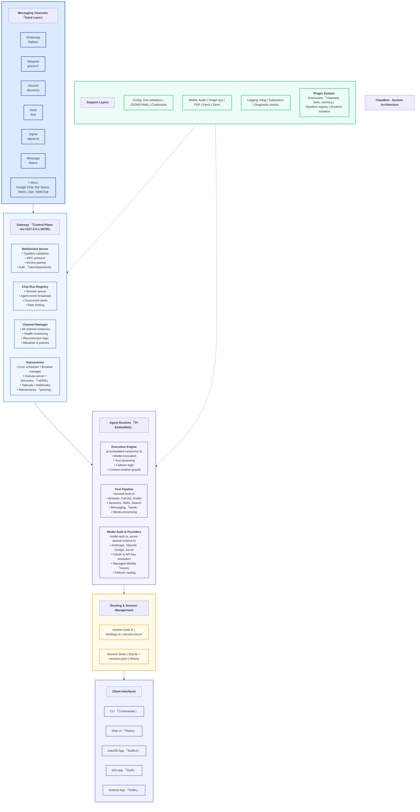

# Clawdbot - System Architecture



## Architecture Overview

### Layer 1: Messaging Channels (Input Layer)
**Purpose**: Accept messages from various messaging platforms

**Channels**:
- **WhatsApp** (Baileys library)
- **Telegram** (grammY framework)
- **Discord** (discord.js)
- **Slack** (Bolt framework)
- **Signal** (signal-cli)
- **iMessage** (Native integration)
- **+ More**: Google Chat, MS Teams, Matrix, Zalo, WebChat

### Layer 2: Gateway (Control Plane)
**Purpose**: Central coordination and control plane
**Endpoint**: `ws://127.0.0.1:18789`

**Components**:

1. **WebSocket Server**
   - TypeBox validation for message schemas
   - RPC protocol implementation
   - Device pairing management
   - Authentication (token/password)

2. **Chat Run Registry**
   - Session queue management
   - Agent event broadcasting
   - Concurrent lane handling
   - Rate limiting enforcement

3. **Channel Manager**
   - Manages all channel instances
   - Health monitoring for channels
   - Automatic reconnection logic
   - Allowlist and policy enforcement

4. **Subsystems**
   - Cron scheduler for automated tasks
   - Browser automation manager
   - Canvas rendering server
   - mDNS-based service discovery
   - Tailscale VPN integration
   - Webhooks for external integrations
   - Maintenance tasks (log pruning, cleanup)

### Layer 3: Agent Runtime (Pi Embedded)
**Purpose**: Execute AI agent logic and tool calls

**Components**:

1. **Execution Engine** (`pi-embedded-runner/run.ts`)
   - Model invocation and response handling
   - Tool call streaming
   - Automatic failover logic
   - Context window management and guards

2. **Tool Pipeline** (`channel-tools.ts`)
   - Browser automation tools
   - Canvas rendering tools
   - Node.js execution environment
   - Session management tools
   - Skills execution framework
   - Web search integration
   - Message sending capabilities
   - Media processing (images, audio, video)

3. **Model Auth & Providers** (`model-auth.ts`, `azure-openai-runtime.ts`)
   - Multi-provider support: Anthropic, OpenAI, Google, Azure
   - OAuth and API key resolution
   - Azure Managed Identity support
   - Intelligent failover routing between providers

### Layer 4: Routing & Session Management
**Purpose**: Route messages and manage conversation state

**Components**:
- **Route Resolution** (`resolve-route.ts`, `bindings.ts`, `session-key.ts`)
  - Determines which agent handles which conversation
  - Manages channel-to-agent bindings
  - Session key generation and mapping

- **Session Store** (SQLite + `sessions.json`)
  - Persistent conversation history
  - Session state management
  - Message archival

### Layer 5: Support Layers
**Purpose**: Cross-cutting infrastructure services

**Services**:

1. **Configuration Management**
   - Zod schema validation
   - JSON5/YAML configuration parsing
   - Secure credential storage

2. **Media Processing**
   - Audio transcription and synthesis
   - Image manipulation and optimization
   - PDF generation and parsing
   - URL fetching and content extraction
   - Media storage and retrieval

3. **Logging System**
   - tslog-based structured logging
   - Per-subsystem log levels
   - Diagnostic event tracking

4. **Plugin System**
   - Extension points for channels, tools, and memory
   - Manifest-based plugin registry
   - Runtime isolation for security
   - Dynamic plugin loading

### Layer 6: Client Interfaces
**Purpose**: User-facing interfaces to interact with the system

**Interfaces**:
- **CLI** (Commander.js) - Command-line interface
- **Web UI** (React) - Browser-based interface
- **macOS App** (SwiftUI) - Native macOS application
- **iOS App** (Swift) - Native iPhone/iPad app
- **Android App** (Kotlin) - Native Android application

## Data Flow

```
User Message
    ↓
[Messaging Channel] → Receives message via platform SDK
    ↓
[Gateway] → Validates, authenticates, routes to agent
    ↓
[Agent Runtime] → Executes AI logic, calls tools
    ↓
[Routing & Session] → Updates session state, stores history
    ↓
[Client Interface] → Displays response (if applicable)
```

## Key Technologies

- **Language**: TypeScript, Swift, Kotlin
- **Runtime**: Node.js (Pi Embedded)
- **Communication**: WebSocket (RPC)
- **Storage**: SQLite, JSON files
- **AI Models**: Anthropic Claude, OpenAI GPT, Google Gemini, Azure OpenAI
- **Authentication**: OAuth 2.0, API keys, Azure Managed Identity
- **Validation**: TypeBox, Zod
- **Logging**: tslog

## Security Features

- Token/password authentication
- Allowlist-based access control
- Runtime isolation for plugins
- Secure credential storage
- Rate limiting
- Message validation

## Scalability Features

- Concurrent lane processing
- Session queue management
- Automatic failover routing
- Health monitoring and auto-reconnection
- Efficient context window management

---

**Architecture Version**: 1.0
**Last Updated**: 2026-02-07
**Document Type**: System Architecture Diagram
