# Clawdbot - Tool Pipeline Architecture

```mermaid
graph TB
    %% Agent Entry Point
    agent["🤖 AI Agent<br/>(Pi Embedded Runner)"]

    %% Tool Pipeline Manager
    subgraph pipeline["Tool Pipeline Manager"]
        direction TB
        registry["Tool Registry<br/>• Tool discovery<br/>• Policy enforcement<br/>• Schema validation"]
        dispatcher["Tool Dispatcher<br/>• Route to category<br/>• Error handling<br/>• Result formatting"]
        policy["Policy Engine<br/>• Allow/deny lists<br/>• Sandbox mode<br/>• Provider-specific<br/>• Group policies"]
    end

    %% Browser Automation Tools
    subgraph browser["🌐 Browser Automation"]
        direction TB
        browser_main["Browser Manager"]
        browser_tools["Tool Set:<br/>• browser_start<br/>• browser_stop<br/>• browser_status<br/>• browser_navigate<br/>• browser_act<br/>• browser_screenshot<br/>• browser_pdf_save<br/>• browser_console"]

        pw_core["Playwright Core<br/>• Page interactions<br/>• Element selection<br/>• File downloads<br/>• Dialog handling<br/>• Network monitoring"]

        browser_proxy["Node Proxy<br/>• Remote browser<br/>• Distributed control<br/>• Load balancing"]
    end

    %% Canvas Tools
    subgraph canvas["🎨 Canvas & A2UI"]
        direction TB
        canvas_main["Canvas Manager"]
        canvas_tools["Tool Set:<br/>• canvas_present<br/>• canvas_hide<br/>• canvas_navigate<br/>• canvas_eval<br/>• canvas_snapshot<br/>• a2ui_push<br/>• a2ui_reset"]

        canvas_render["Rendering Engine<br/>• HTML/CSS/JS<br/>• Screenshot capture<br/>• Interactive UI"]
    end

    %% Execution Environment
    subgraph exec["⚙️ Node.js Execution"]
        direction TB
        exec_main["Execution Manager"]
        exec_tools["Tool Set:<br/>• exec (shell)<br/>• process (background)<br/>• read (files)<br/>• write (files)<br/>• edit (patches)"]

        sandbox["Sandbox Context<br/>• Isolated workspace<br/>• Path restrictions<br/>• Permission checks"]

        bash_tools["Bash Tools<br/>• Command execution<br/>• Process management<br/>• Environment vars<br/>• Timeout control"]
    end

    %% Session Management
    subgraph sessions["💬 Session Management"]
        direction TB
        session_main["Session Manager"]
        session_tools["Tool Set:<br/>• sessions_list<br/>• sessions_history<br/>• sessions_send<br/>• sessions_spawn<br/>• session_status"]

        session_store["Session Store<br/>• SQLite DB<br/>• History tracking<br/>• State persistence"]

        routing["Routing Engine<br/>• Session keys<br/>• Agent bindings<br/>• Channel mapping"]
    end

    %% Skills Framework
    subgraph skills["🛠️ Skills Execution"]
        direction TB
        skill_main["Skills Manager"]
        skill_tools["Skill Types:<br/>• Native binaries<br/>• npm packages<br/>• Shell scripts<br/>• Python scripts"]

        skill_loader["Skill Loader<br/>• Discovery<br/>• Installation<br/>• Dependency mgmt<br/>• Execution"]

        skill_catalog["Skill Catalog<br/>~/.claude/skills/<br/>• Per-skill config<br/>• SKILL.md docs"]
    end

    %% Web Integration
    subgraph web["🔍 Web Integration"]
        direction TB
        web_main["Web Tools Manager"]
        web_search["web_search<br/>• Brave Search API<br/>• Query processing<br/>• Result ranking<br/>• Context extraction"]

        web_fetch["web_fetch<br/>• URL fetching<br/>• HTML parsing<br/>• Content extraction<br/>• Media download"]

        web_cache["Response Cache<br/>• 15-min cache<br/>• Deduplication"]
    end

    %% Messaging Tools
    subgraph messaging["📨 Messaging"]
        direction TB
        msg_main["Message Manager"]
        msg_tools["Tool Set:<br/>• message (send)<br/>• message_react<br/>• message_edit<br/>• message_delete"]

        channel_plugins["Channel Plugins<br/>• Telegram<br/>• WhatsApp<br/>• Discord<br/>• Slack"]

        threading["Thread Management<br/>• Reply-to linking<br/>• Topic routing<br/>• Auto-threading"]
    end

    %% Media Processing
    subgraph media["🎬 Media Processing"]
        direction TB
        media_main["Media Manager"]

        img_tools["Image Tools<br/>• image (analyze)<br/>• Resize/crop<br/>• Format conversion<br/>• OCR (future)"]

        audio_tools["Audio Tools<br/>• tts (synthesis)<br/>• Transcription<br/>• Format conversion"]

        video_tools["Video Tools<br/>• Frame extraction<br/>• Compression<br/>• Format conversion"]

        media_store["Media Store<br/>• Local filesystem<br/>• Metadata tracking<br/>• Cleanup policies"]
    end

    %% Additional Tools
    subgraph additional["🔧 Additional Tools"]
        direction TB
        nodes_tool["nodes<br/>• List remote nodes<br/>• Node capabilities<br/>• Health status"]

        cron_tool["cron<br/>• Schedule tasks<br/>• Recurring jobs<br/>• Timezone support"]

        gateway_tool["gateway<br/>• Control plane access<br/>• Configuration<br/>• System status"]

        agents_tool["agents_list<br/>• List agents<br/>• Agent metadata<br/>• Capabilities"]

        image_tool["image<br/>• Vision analysis<br/>• Multi-modal input"]
    end

    %% Plugin System
    subgraph plugins["🔌 Plugin System"]
        direction TB
        plugin_main["Plugin Manager"]
        plugin_tools["Plugin Tools<br/>• Dynamic registration<br/>• Custom tools<br/>• Extension points"]

        plugin_registry["Plugin Registry<br/>~/.clawdbot/extensions/<br/>• Manifest parsing<br/>• Runtime isolation"]
    end

    %% Storage Layer
    subgraph storage["💾 Storage Layer"]
        direction LR
        file_store["File Store<br/>• Agent workspace<br/>• Media files<br/>• Temp files"]

        db_store["Database<br/>• SQLite<br/>• Sessions<br/>• History"]

        config_store["Configuration<br/>• clawdbot.json<br/>• Credentials<br/>• Policies"]
    end

    %% Flow Connections
    agent --> registry
    registry --> dispatcher
    dispatcher --> policy

    policy --> browser_main
    policy --> canvas_main
    policy --> exec_main
    policy --> session_main
    policy --> skill_main
    policy --> web_main
    policy --> msg_main
    policy --> media_main
    policy --> nodes_tool
    policy --> plugin_main

    browser_main --> browser_tools
    browser_tools --> pw_core
    browser_tools --> browser_proxy

    canvas_main --> canvas_tools
    canvas_tools --> canvas_render

    exec_main --> exec_tools
    exec_tools --> sandbox
    exec_tools --> bash_tools

    session_main --> session_tools
    session_tools --> session_store
    session_tools --> routing

    skill_main --> skill_tools
    skill_tools --> skill_loader
    skill_loader --> skill_catalog

    web_main --> web_search
    web_main --> web_fetch
    web_search --> web_cache
    web_fetch --> web_cache

    msg_main --> msg_tools
    msg_tools --> channel_plugins
    msg_tools --> threading

    media_main --> img_tools
    media_main --> audio_tools
    media_main --> video_tools
    img_tools --> media_store
    audio_tools --> media_store
    video_tools --> media_store

    plugin_main --> plugin_tools
    plugin_tools --> plugin_registry

    %% Storage connections
    exec_tools -.-> file_store
    session_store -.-> db_store
    media_store -.-> file_store
    policy -.-> config_store
    plugin_registry -.-> file_store

    %% Styling
    classDef agentStyle fill:#fee,stroke:#c00,stroke-width:3px,color:#000
    classDef pipelineStyle fill:#fef,stroke:#c0c,stroke-width:2px,color:#000
    classDef browserStyle fill:#e3f2fd,stroke:#1976d2,stroke-width:2px,color:#000
    classDef canvasStyle fill:#f3e5f5,stroke:#7b1fa2,stroke-width:2px,color:#000
    classDef execStyle fill:#fff3e0,stroke:#f57c00,stroke-width:2px,color:#000
    classDef sessionStyle fill:#e8f5e9,stroke:#388e3c,stroke-width:2px,color:#000
    classDef skillStyle fill:#fce4ec,stroke:#c2185b,stroke-width:2px,color:#000
    classDef webStyle fill:#e0f2f1,stroke:#00796b,stroke-width:2px,color:#000
    classDef msgStyle fill:#e1f5fe,stroke:#0288d1,stroke-width:2px,color:#000
    classDef mediaStyle fill:#f1f8e9,stroke:#689f38,stroke-width:2px,color:#000
    classDef additionalStyle fill:#fafafa,stroke:#616161,stroke-width:2px,color:#000
    classDef pluginStyle fill:#fff9c4,stroke:#f9a825,stroke-width:2px,color:#000
    classDef storageStyle fill:#efebe9,stroke:#5d4037,stroke-width:2px,color:#000

    class agent agentStyle
    class registry,dispatcher,policy pipelineStyle
    class browser_main,browser_tools,pw_core,browser_proxy browserStyle
    class canvas_main,canvas_tools,canvas_render canvasStyle
    class exec_main,exec_tools,sandbox,bash_tools execStyle
    class session_main,session_tools,session_store,routing sessionStyle
    class skill_main,skill_tools,skill_loader,skill_catalog skillStyle
    class web_main,web_search,web_fetch,web_cache webStyle
    class msg_main,msg_tools,channel_plugins,threading msgStyle
    class media_main,img_tools,audio_tools,video_tools,media_store mediaStyle
    class nodes_tool,cron_tool,gateway_tool,agents_tool,image_tool additionalStyle
    class plugin_main,plugin_tools,plugin_registry pluginStyle
    class file_store,db_store,config_store storageStyle
```



## Tool Pipeline Overview

The Tool Pipeline is the execution layer that enables the AI agent to interact with external systems, execute commands, manipulate files, and perform various operations. It follows a layered architecture with strict policy enforcement.

## Architecture Components

### 1. Tool Pipeline Manager

**Purpose**: Central coordination and routing for all tool executions

**Components**:
- **Tool Registry**: Discovers and registers all available tools
  - Scans built-in tools
  - Loads plugin tools
  - Validates tool schemas
  - Maintains tool metadata

- **Tool Dispatcher**: Routes tool calls to appropriate handlers
  - Parses tool call parameters
  - Validates input schemas
  - Handles execution errors
  - Formats results for agent consumption

- **Policy Engine**: Enforces access control and security
  - Allow/deny list evaluation
  - Sandbox mode restrictions
  - Provider-specific tool availability
  - Group-level policies
  - Per-agent policies

### 2. Browser Automation (`browser`)

**Purpose**: Web browser control and automation via Playwright

**Capabilities**:
- Start/stop browser instances
- Navigate to URLs
- Interact with page elements (click, type, select)
- Take screenshots (full page, element, viewport)
- Save pages as PDF
- Monitor console messages
- Handle file downloads
- Manage dialogs and prompts
- Execute JavaScript in page context

**Implementation**:
- **Playwright Core**: Low-level browser control
- **Node Proxy**: Distributed browser instances on remote nodes
- **Browser Profiles**: Multiple browser contexts (logged-in states)

**Key Files**:
- `src/agents/tools/browser-tool.ts`
- `src/browser/pw-tools-core.ts`
- `src/browser/client-actions.ts`

### 3. Canvas & A2UI (`canvas`)

**Purpose**: Visual UI rendering and Agent-to-UI communication

**Capabilities**:
- Present canvas window with custom UI
- Navigate to URLs in canvas
- Execute JavaScript in canvas context
- Capture canvas screenshots
- Push A2UI (Agent-to-UI) messages for interactive UIs
- Reset UI state

**Use Cases**:
- Visual feedback to users
- Interactive dashboards
- Data visualization
- UI prototyping

**Key Files**:
- `src/agents/tools/canvas-tool.ts`
- `src/cli/nodes-canvas.js`

### 3. Node.js Execution Environment (`exec`)

**Purpose**: Execute shell commands and manage file operations

**Tools**:
- **exec**: Execute shell commands with timeout control
- **process**: Background process management
- **read**: Read files from workspace
- **write**: Write files to workspace
- **edit**: Apply patches to existing files

**Security Features**:
- **Sandbox Context**: Isolated workspace per agent
- **Path Restrictions**: Prevent access outside workspace
- **Safe Binary Allowlist**: Whitelist of allowed commands
- **Timeout Control**: Prevent runaway processes
- **Approval System**: User confirmation for dangerous operations

**Key Files**:
- `src/agents/bash-tools.ts`
- `src/agents/sandbox.ts`
- `@mariozechner/pi-coding-agent` (file operations)

### 5. Session Management (`sessions`)

**Purpose**: Manage conversation sessions and inter-agent communication

**Tools**:
- **sessions_list**: List active sessions
- **sessions_history**: Retrieve conversation history
- **sessions_send**: Send messages to other sessions
- **sessions_spawn**: Create child agent sessions (subagents)
- **session_status**: Check session state

**Architecture**:
- **Session Store**: SQLite database for persistence
- **Routing Engine**: Maps channels to agents
- **Session Keys**: Unique identifiers (e.g., `telegram:user:123:main`)

**Use Cases**:
- Multi-agent workflows
- Task delegation
- Conversation context management

**Key Files**:
- `src/agents/tools/sessions-*.ts`
- `src/routing/session-key.ts`

### 6. Skills Execution Framework (`skills`)

**Purpose**: Execute external skills (CLI tools, scripts, packages)

**Skill Types**:
- Native binaries (e.g., `gog`, `pandoc`)
- npm packages
- Shell scripts
- Python scripts

**Workflow**:
1. Skill discovery in `~/.claude/skills/`
2. Dependency installation (if needed)
3. Command construction from `SKILL.md`
4. Execution with parameters
5. Result parsing and return

**Skill Structure**:
```
~/.claude/skills/skill-name/
├── SKILL.md              # Documentation and usage
├── package.json          # npm dependencies (optional)
├── scripts/              # Scripts (optional)
└── node_modules/         # Installed deps (optional)
```

**Key Files**:
- `src/agents/skills.ts`
- Skills directory: `~/.claude/skills/`

### 7. Web Integration (`web`)

**Purpose**: Web search and content fetching

**Tools**:
- **web_search**: Search the web via Brave Search API
  - Query processing
  - Result ranking
  - Context extraction
  - Pagination support

- **web_fetch**: Fetch and parse web content
  - HTML to markdown conversion
  - Content extraction
  - Media downloading
  - Redirect handling

**Features**:
- 15-minute response cache
- Deduplication
- Sandbox mode support (restricted in sandbox)

**Key Files**:
- `src/agents/tools/web-tools.ts`
- `src/agents/tools/web-search.ts`

### 8. Messaging (`message`)

**Purpose**: Send messages through various channels

**Tools**:
- **message**: Send messages to users/groups
- **message_react**: Add reactions to messages
- **message_edit**: Edit sent messages
- **message_delete**: Delete messages

**Features**:
- **Channel Plugins**: Telegram, WhatsApp, Discord, Slack
- **Thread Management**: Reply-to linking, topic routing
- **Auto-threading**: Automatic thread continuation (Slack)

**Key Files**:
- `src/agents/tools/message-tool.ts`
- `src/channels/plugins/`

### 9. Media Processing (`media`)

**Purpose**: Process images, audio, and video

**Capabilities**:

**Image**:
- Vision analysis (via LLM)
- Resize and crop
- Format conversion
- Metadata extraction

**Audio**:
- Text-to-speech synthesis
- Transcription (future)
- Format conversion

**Video**:
- Frame extraction
- Compression
- Format conversion

**Media Store**:
- Local filesystem storage
- Metadata tracking
- Automatic cleanup

**Key Files**:
- `src/agents/tools/image-tool.ts`
- `src/agents/tools/tts-tool.ts`
- `src/media/store.ts`

### 10. Additional Tools

**nodes**: List and manage remote nodes
- Node discovery
- Capability checking
- Health monitoring

**cron**: Schedule recurring tasks
- Cron expression support
- Timezone-aware scheduling
- Task management

**gateway**: Gateway control plane access
- Configuration queries
- System status
- Administrative operations

**agents_list**: List available agents
- Agent metadata
- Capabilities discovery
- Configuration access

**image**: Vision analysis
- Multi-modal input
- Image understanding
- OCR capabilities

### 11. Plugin System (`plugins`)

**Purpose**: Extend tool capabilities via plugins

**Features**:
- Dynamic tool registration
- Custom tool implementation
- Runtime isolation
- Manifest-based discovery

**Plugin Location**: `~/.clawdbot/extensions/`

**Plugin Structure**:
```
plugin-name/
├── index.ts                    # Plugin entry point
├── clawdbot.plugin.json        # Manifest
├── package.json                # Dependencies
└── src/                        # Implementation
```

**Key Files**:
- `src/plugins/tools.ts`
- `src/plugins/registry.ts`

## Tool Execution Flow

```
1. Agent Request
   ↓
2. Tool Registry → Validate tool exists
   ↓
3. Policy Engine → Check permissions
   ↓
4. Tool Dispatcher → Route to handler
   ↓
5. Tool Implementation → Execute
   ↓
6. Result Formatting → Return to agent
```

## Policy Enforcement Layers

1. **Global Policy**: `config.tools.allow`
2. **Provider Policy**: `config.agents.defaults.models[provider].tools.allow`
3. **Agent Policy**: `config.agents.list[agent].tools.allow`
4. **Group Policy**: Channel/group-specific restrictions
5. **Subagent Policy**: Inherited from parent + restrictions

**Evaluation**: Most restrictive policy wins

## Security Features

- **Sandbox Mode**: Isolated workspace, restricted tool access
- **Path Restrictions**: Tools cannot access files outside workspace
- **Safe Binary Allowlist**: Only approved commands can be executed
- **Timeout Control**: Prevent long-running operations
- **Approval System**: User confirmation for risky operations
- **Plugin Isolation**: Plugins run in separate context

## Integration Points

### Agent → Tools
- Tools are passed to Pi Embedded Runner
- Agent invokes tools via function calling
- Results are formatted and returned

### Tools → Storage
- **File Store**: Agent workspace, media files
- **Database**: Session history, state persistence
- **Configuration**: Policy lookups, credential access

### Tools → External Systems
- **Browser**: Web automation via Playwright
- **Skills**: External CLI tools and scripts
- **Web**: HTTP requests for search/fetch
- **Channels**: Message sending via channel plugins

## Performance Considerations

- **Caching**: Web search/fetch responses cached for 15 minutes
- **Parallel Execution**: Multiple tools can run concurrently
- **Background Processes**: Long-running tasks via `process` tool
- **Connection Pooling**: Browser instances reused across calls

## Error Handling

- **Validation Errors**: Schema validation before execution
- **Execution Errors**: Try-catch with detailed error messages
- **Timeout Errors**: Graceful termination after timeout
- **Permission Errors**: Clear denial messages
- **Result Formatting**: Structured error responses

## Tool Categories Summary

| Category | Tools | Key Features |
|----------|-------|--------------|
| Browser | 8+ actions | Playwright automation, screenshots, PDF |
| Canvas | 7 actions | UI rendering, A2UI, snapshots |
| Execution | 5 tools | Shell, files, background processes |
| Sessions | 5 tools | Multi-agent, spawning, messaging |
| Skills | Dynamic | External CLI tools, scripts |
| Web | 2 tools | Search, fetch, caching |
| Messaging | 4+ tools | Multi-channel, threading |
| Media | 3 categories | Image, audio, video processing |
| Additional | 5 tools | Nodes, cron, gateway, agents, vision |
| Plugins | Dynamic | Custom extensions |

---

**Architecture Version**: 1.0
**Last Updated**: 2026-02-07
**Total Tool Categories**: 10+
**Total Tools**: 50+
